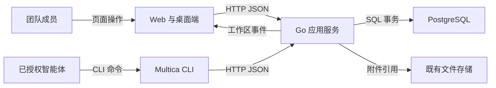
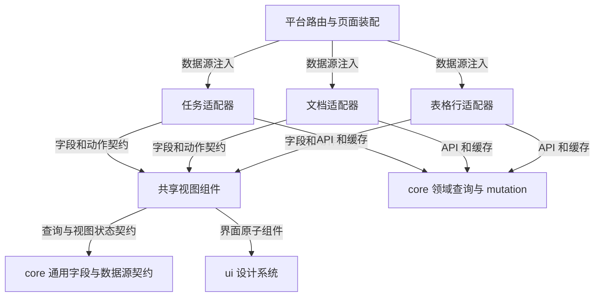
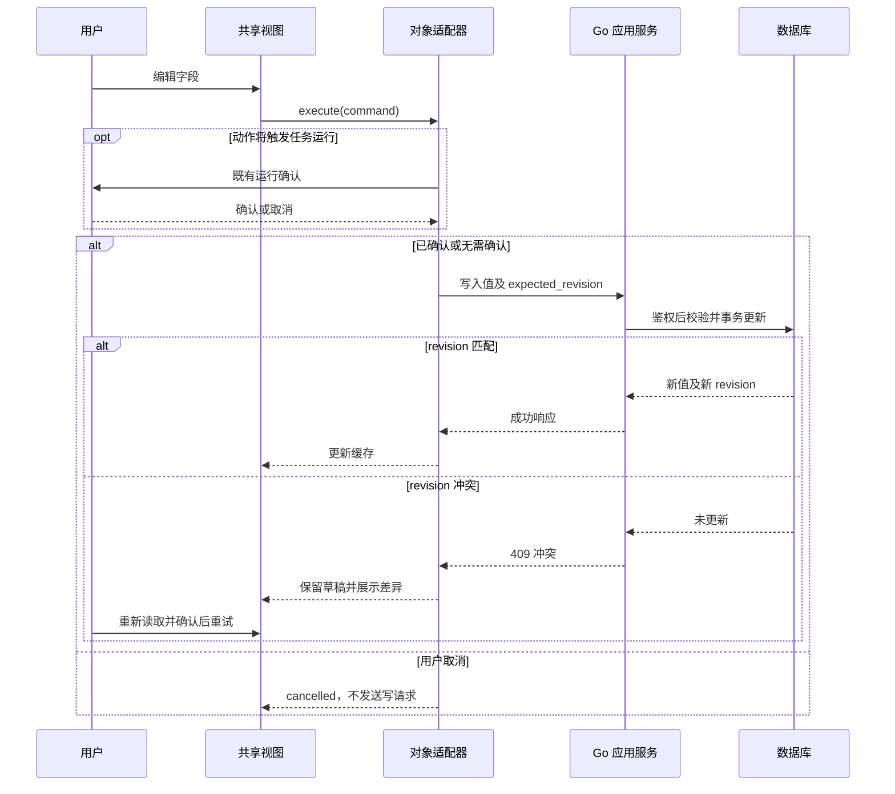
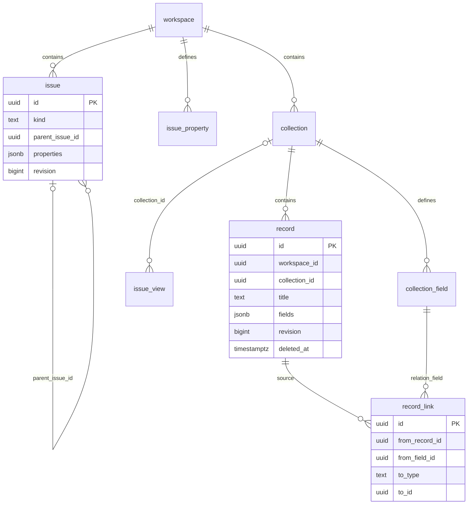
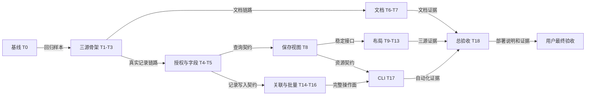

建议采用“文档复用 issue、表格行独立存储、字段与视图逐步泛化”的方案，并由 kiki 开发、momo 测试、bubu 架构评审组成协作小队。第一步先打通三类对象共用 table 的真实读写闭环，再按下面的自验门禁扩展。

**本轮交付是实施方案，G-1 尚未实现。** 当前架构师角色被 `AGENTS.md` 明确限定为“绝不修改代码……即使用户要求直接实施，也只输出方案”。因此没有创建实施用 feature 分支、提交代码、执行迁移、启动服务或派发其他智能体；实施应交由 kiki 等实现角色承接。CLI 为阅读创建的 `agent/bubu/6bec3c85d470` 是只读分析副本，不是用户要求的 feature 分支。

已核实实际远端分支是 `docs/architecture-handbook`，不存在字面名称为 `docs` 的分支。以下分析固定在 `2ef09f14c7cfe22349d7144ead5195988c363ffc`；它已包含当前远端 `main@3dcfdaea412c3673153871cd29ea9021d174c0ee`。PRD 的旧基线说明不能当成当前代码状态。

G-1 的原始判定是“三类对象在同一套视图组件下渲染，引擎层无任何具体对象类型的分支代码”，见 `apps/docs/public/handbook/cortex-prd.html:586`。建议范围覆盖 FR-001～005、FR-011～016、FR-021～028；保留原有 list，泛化 table/board/gantt/swimlane，并新增 calendar/gallery。首个 table 闭环只是里程碑，不能据此宣称整个 G-1 完成。文档内嵌活视图属于 G-2，知识库和 Workflow 属于 G-3/G-4，本次不作为完成条件；段落软锁、版本历史等 P1 另行排期。

有三项实施前需明确的范围或权限选择，方案先按标注假设推进：

- **阻塞授权设计：** FR-027 要求智能体建表、建字段，但现有 `server/internal/handler/property.go:630` 明确禁止智能体管理 issue 字段定义。推荐保留 issue 原规则，为新 collection 单独定义 schema 写权限：人类 owner/admin 可管理；智能体只在链顶人类授权主体仍具备对应管理权时执行。另一可行选择是集合字段也只允许人类管理，但会缩减 FR-027。推荐前者，权限变化须确认后实施，不能直接复用 runtime owner 放行。
- **影响端范围：** PRD 的 NG-10/NFR-043 包含移动端，而 Q-U4 建议延期，两处冲突见 `apps/docs/public/handbook/cortex-prd.html:1183`。本方案按 Web + Desktop 验收；现有移动客户端做 API 兼容回归。若移动端同步交付，需要增加独立 UI、hooks、弱网与分发任务，不能直接复用 Web 视图。
- **可后置假设：** actor 暂仅支持 member；保留旧 saved view 和默认任务列表行为，新文档通过独立入口展示，并提供显式类型过滤。开放 agent/squad 或改变旧列表默认内容都需单独确认。

| 方案 | 复杂度与迁移成本 | 运维、可测试性与长期成本 | 判断 |
| --- | --- | --- | --- |
| A：`issue.kind=doc`；新 collection/record；原地抽共享引擎 | 中高；必须拆开现有 issue 耦合，但保留评论、搜索、权限和生命周期 | 沿用 Go/PostgreSQL/现有前端；符合团队现有技术栈；可用三源契约测试防漂移，无新供应商锁定 | **推荐，与 PRD 一致** |
| B：独立 doc 表与 API，再为文档、issue、record 提供三个适配器 | 高；文档树更独立，但评论、附件、搜索、权限、智能体寻址都需重新接线 | 部署仍可保持单体；测试面和长期上游同步成本更大 | 可行，但需重写 FR-011 等已定需求，当前收益不足 |

已有代码能复用，但不是零工作量：`packages/views/issues/components/table-view.tsx:93` 直接调用 issue 查询、状态和运行确认；`server/internal/handler/property.go:460` 的值校验接收 `db.IssueProperty`，需要抽出与存储无关的字段定义。9 类字段及 member-only actor 在 `packages/core/types/property.ts:12`、`:48`；issue 的 20 字段配额和 16KB 值袋限制必须保留。saved view 已有私有/共享访问和 revision 冲突处理，见 `server/pkg/db/queries/issue_view.sql:9`、`:34`。文档状态目录目前按 workspace 管理，不具备文档专属作用域，见 `server/pkg/db/queries/issue_status.sql:25`。

架构边界保持现有部署形态，不引入新框架、中间件或存储服务。



这张图回答运行边界：文档、集合、视图进入现有 API 与数据库；G-1 的基础验收不需要知识后端或真实模型调用。附件沿用既有存储，数据库只存引用和元数据。



箭头表示允许的代码依赖。**禁止共享引擎反向依赖任务、文档或集合适配器；禁止 ui 依赖 core。** 用导入边界检查覆盖 type import、重导出和间接依赖，并用一个不含 issue 字段的第四种测试数据源验证可替换性。仅搜索 `if (kind)` 不足以证明解耦。

推荐新增目录为 `packages/core/fields/`、`packages/core/data-source/`、`packages/core/collections/`、`packages/views/data-view/`、`packages/views/documents/`、`packages/views/collections/`，后端纯字段规则放 `server/internal/field/`。这些均是拟新增路径。现有 issue 模块作为适配方；避免复制一套表格代码或把 record 强转成 Issue。

数据源接口草案如下；字段类型允许分支，对象类型分支只能留在适配器或领域服务内。

```ts
interface DataSource<Row> {
  fields: readonly FieldDefinition[];
  capabilities: ViewCapabilities;
  rowId(row: Row): string;
  read(query: QuerySpec, page: PageRequest,
       signal: AbortSignal): Promise<Page<Row>>;
  execute(command: RowCommand): Promise<ActionResult<Row>>;
}
```

`ViewCapabilities` 明确分页上限、可排序/分组字段、日期字段、层级、重排和可写动作；不提供 `isIssue`。`ActionResult` 区分成功、取消确认和失败。缺少日期字段时显示选择字段提示；无层级或依赖能力的 record 不显示任务专属操作。字段编辑器按字段类型注册，issue 的 status/assignee 等系统字段由适配器投影。

服务端状态统一由 React Query 管理；缓存键含 workspace、数据源 ID、view ID 与查询条件。Zustand 仅保存过滤显示状态、选择和草稿。WebSocket 更新或失效 Query 缓存；断线重连重新查询。新页面在 Web 和 Desktop 同时接线，按路由加载，复用语义 token 与现有编辑器；不把 `DataSource` 调试标记展示给产品用户。



这张图定义成功、取消和冲突恢复：record 写入不进入任务调度路径；任务和文档沿用既有副作用确认。网络失败保留草稿；发生冲突时不能自动用旧内容覆盖新版本。文档父子关系还要验证发布最后一个子页的行为，因为既有无 stage 子任务也会形成隐式阶段屏障，见 `server/internal/handler/issue_child_done.go:44`；不能把页面树移动和流程推进混为一谈。

拟新增 REST 资源使用 `/api/collections`、`/api/collections/{id}/fields`、`/api/collections/{id}/records`，文档继续走 issue API 并增加 kind。查询使用受限 JSON 查询模型，操作符由通用字段模块校验、值参数化；禁止客户端提供 SQL 表名或表达式。记录分页最多 200，issue 保留现有最多 100 的约束，通过能力描述呈现，见 `server/internal/handler/issue_table_query.go:24`。游标绑定 workspace、数据源和查询摘要，稳定排序追加 id；不能一次拉取十万行到浏览器。

新增资源的单条与批量修改携带 revision；批量上限 500，整批校验后原子提交，失败给行号和字段定位。CSV 导入按固定批次提交并返回成功/失败计数与续传位置；以导入 ID、行号和内容摘要去重，重复请求不重复建行，同键不同内容拒绝。未知字段或操作符返回可诊断的 400；跨工作区或不可见资源返回 404，可见但无写权返回 403，冲突返回 409。CLI 覆盖建表、建字段、增删改查记录、导入、批量与 JSON 输出；具体命令和内建 skill 文档在对应任务中一起交付。

API 演进采用新增字段与现有 `definition_version`：旧响应缺 kind 时按 task 解析，未知枚举保持可显示且不擅自发起写操作；对每个新增/变更端点补 zod 与 malformed-response 测试。旧客户端调用视图列表时不返回它不能识别的 collection 视图；旧视图 `collection_id=NULL` 的读取、保存和偏好行为保持一致。

数据结构建议保留两种字段目录，但共用同一套类型、校验、选项和过滤逻辑：issue/doc 使用 `issue_property`，每个 collection 使用自己的 `collection_field`，分别执行 20 和 50 的配额策略。这是独立 schema 的边界，不是两套字段实现。



这张图描述逻辑关系，不生成数据库外键。`record_link.to_id` 按 `to_type` 指向 record 或 issue；写入和解析均校验目标权限。目标删除后保留失效关联并显示“已删除”，不能因反向引用泄露目标内容。record 中冗余 workspace_id 用于直接租户过滤，省去按行查询时的一次 collection join；创建和迁移通过同一事务校验一致性。

以下是 DDL 草案，不是已验证迁移。编号由实现者依据实施时最新迁移序号分配。

```sql
ALTER TABLE issue
  ADD COLUMN kind TEXT NOT NULL DEFAULT 'task';
ALTER TABLE issue_view ADD COLUMN collection_id UUID;

CREATE TABLE collection (
  id UUID NOT NULL DEFAULT gen_random_uuid(),
  workspace_id UUID NOT NULL,
  project_id UUID,
  name TEXT NOT NULL CHECK (length(btrim(name)) > 0),
  icon TEXT NOT NULL DEFAULT '',
  description TEXT NOT NULL DEFAULT '',
  created_by_type TEXT NOT NULL CHECK (created_by_type IN ('member','agent')),
  created_by UUID NOT NULL,
  revision BIGINT NOT NULL DEFAULT 1 CHECK (revision > 0),
  archived_at TIMESTAMPTZ,
  created_at TIMESTAMPTZ NOT NULL DEFAULT now(),
  updated_at TIMESTAMPTZ NOT NULL DEFAULT now()
);

CREATE TABLE collection_field (
  id UUID NOT NULL DEFAULT gen_random_uuid(),
  workspace_id UUID NOT NULL,
  collection_id UUID NOT NULL,
  name TEXT NOT NULL CHECK (length(btrim(name)) > 0),
  type TEXT NOT NULL CHECK (type IN
    ('text','number','select','multi_select','date','checkbox',
     'url','actor','multi_actor','relation')),
  description TEXT NOT NULL DEFAULT '',
  config JSONB NOT NULL DEFAULT '{}'::jsonb
    CHECK (jsonb_typeof(config) = 'object'),
  position DOUBLE PRECISION NOT NULL DEFAULT 0,
  revision BIGINT NOT NULL DEFAULT 1 CHECK (revision > 0),
  archived_at TIMESTAMPTZ,
  created_at TIMESTAMPTZ NOT NULL DEFAULT now(),
  updated_at TIMESTAMPTZ NOT NULL DEFAULT now()
);

CREATE TABLE record (
  id UUID NOT NULL DEFAULT gen_random_uuid(),
  workspace_id UUID NOT NULL,
  collection_id UUID NOT NULL,
  title TEXT NOT NULL DEFAULT '',
  fields JSONB NOT NULL DEFAULT '{}'::jsonb
    CHECK (jsonb_typeof(fields) = 'object')
    CHECK (pg_column_size(fields) <= 65536),
  position DOUBLE PRECISION NOT NULL DEFAULT 0,
  revision BIGINT NOT NULL DEFAULT 1 CHECK (revision > 0),
  created_by_type TEXT NOT NULL CHECK (created_by_type IN ('member','agent')),
  created_by UUID NOT NULL,
  deleted_at TIMESTAMPTZ,
  created_at TIMESTAMPTZ NOT NULL DEFAULT now(),
  updated_at TIMESTAMPTZ NOT NULL DEFAULT now()
);

CREATE TABLE record_link (
  id UUID NOT NULL DEFAULT gen_random_uuid(),
  workspace_id UUID NOT NULL,
  from_record_id UUID NOT NULL,
  from_field_id UUID NOT NULL,
  to_type TEXT NOT NULL CHECK (to_type IN ('record','issue')),
  to_id UUID NOT NULL,
  created_at TIMESTAMPTZ NOT NULL DEFAULT now()
);
```

每张新表先单独创建 `CREATE UNIQUE INDEX CONCURRENTLY ... (id)`，再用后续迁移 `ADD CONSTRAINT ... PRIMARY KEY USING INDEX ...` 绑定主键，避免建表时隐式创建非并发索引。每一条并发索引语句独占一个迁移文件；不加 FOREIGN KEY/REFERENCES/CASCADE。并发索引不能运行在事务块内，失败后还需检查无效索引再恢复，不能只重试 `IF NOT EXISTS`。[PostgreSQL 17 索引文档](https://www.postgresql.org/docs/17/sql-createindex.html)

| 高频查询 | 拟建索引与理由 |
| --- | --- |
| 工作区/项目集合列表 | collection `(workspace_id, project_id, created_at DESC, id)`，部分条件 `archived_at IS NULL` |
| 字段目录 | collection_field `(workspace_id, collection_id, position, id)`，部分条件 `archived_at IS NULL`；集合前缀隔离目录 |
| 集合内字段重名检查 | collection_field `(workspace_id, collection_id, lower(name))` 活跃行唯一索引；写入前统一 trim/名称规范化 |
| 默认行分页 | record `(workspace_id, collection_id, position, id)`，部分条件 `deleted_at IS NULL` |
| 回收站与到期清理 | record `(workspace_id, deleted_at, collection_id, id)`，部分条件 `deleted_at IS NOT NULL` |
| 值袋包含过滤 | record `USING GIN(fields)`，活跃行部分索引；数值/日期范围和任意排序不能据此承诺性能，须测执行计划 |
| 关联去重/反向引用 | record_link `(workspace_id, from_record_id, from_field_id, to_type, to_id)` 唯一；另建 `(workspace_id, to_type, to_id, from_record_id)` |
| 集合 saved view 列表 | issue_view `(workspace_id, collection_id, owner_id)`，部分条件 `collection_id IS NOT NULL` |
| 文档树 | issue `(workspace_id, project_id, parent_issue_id, position, id)`，部分条件 `kind='doc'` |

所有这些索引均采用 CONCURRENTLY 独立迁移；通过 EXPLAIN 与压测决定是否继续加索引，记录存储和写放大，不默认给每个动态字段建索引。50 字段配额用集合级事务锁串行校验，不能并发 count 后直接 insert。

主键沿用现有应用层 UUIDv7、数据库 UUIDv4 fallback 模式（`server/pkg/dbid/dbid.go:1`），相比自增 ID 更适合外部引用，且不引入 ULID 编码转换；实际 ID 一律取 RETURNING。时间统一 TIMESTAMPTZ/UTC，日期字段保留 YYYY-MM-DD；枚举存 TEXT 并验证允许值。已有 issue 的 revision 复用，新 collection/field/record 使用 revision 防并发覆盖；record_link 由源 record revision 和事务保护。字段归档保留值，record 软删除至少保留 30 天，清理操作可审计；新业务数据未验收前不自动物理清除。

多租户继续共享表，新增表采用 workspace_id + RLS 作为数据库保护；相较每租户 schema/数据库，这避免了为小团队引入独立迁移和连接池管理。应用必须先鉴权，再在事务内设置经过验证的 workspace 上下文；缺上下文默认拒绝。RLS 草案如下，四张新增表分别应用：

```sql
ALTER TABLE record ENABLE ROW LEVEL SECURITY;
ALTER TABLE record FORCE ROW LEVEL SECURITY;
CREATE POLICY record_workspace_policy ON record
  USING (workspace_id =
    nullif(current_setting('app.workspace_id', true), '')::uuid)
  WITH CHECK (workspace_id =
    nullif(current_setting('app.workspace_id', true), '')::uuid);
```

运行账号不能是 superuser 或 BYPASSRLS；连接复用必须验证事务上下文不会串租户。RLS 无法代替对象写权限，也不防任意控制数据库会话的主体。现有 issue 表仍按既有 workspace SQL 过滤与鉴权处理，本轮不能声称旧系统已获得全面 RLS。新增 RLS/运行账号调整属于高风险权限变更，需随 T4 在 Stage 演练并确认；故障回退关闭集合入口并退到已验证应用版本，不通过关闭隔离来恢复服务。[PostgreSQL 17 行安全文档](https://www.postgresql.org/docs/17/ddl-rowsecurity.html)

容量估算先采用“每工作区每天新增 1000 行、平均值袋 2KiB”的假设：一年约 36.5 万行、值袋约 0.7GiB；每天 1 万行则约 365 万行、7GiB，均未含索引、历史与 WAL。当前不分片；按 PRD，单集合 10 万行强制分页，50 万行触发分区评估，workspace 千万行前重新做容量规划。数据量和真实平均行大小待试用采样，不能把 64KB 上限当平均值。

实施按下表拆成可独立验收的任务草稿。S=约 1 天，M=约 2～3 天；若技术验证发现超出，就继续拆分，不能把一整套视图迁移塞进一个大 PR。表中拟新增目录对应上面的模块边界；迁移、sqlc、API、UI 和该链路测试随各纵切任务共同交付。

| ID / 标题 | 目标与涉及模块 | 前置 | 自验通过标准 | 主要风险 / 规模 |
| --- | --- | --- | --- | --- |
| T0 固定实施基线与回归样本 | feature 分支、现有 issue 视图测试、`e2e/` | 实现角色接手 | 记录 base SHA；保存过滤、排序、列宽、私有视图和运行确认基线；已有失败单独列明 | 错基线 / S |
| T1 任务 table 经通用契约读写 | `core/data-source`、`views/data-view`、issue 适配器 | T0 | 生产任务列表改走共享 table；真实改一字段、刷新可见；不改变既有确认 | 大组件耦合 / M |
| T2 文档进入同一 table | issue kind、创建/详情/列表、core schema、Web/Desktop 路由 | T1 | 新建 doc、保存正文、刷新后仍在；同一 table 可显示 task/doc；缺 kind 的旧响应通过 | 旧客户端 / M |
| T3 三源最小闭环 | collection/record 最小迁移、API、简单字段和集合页 | T2 | 同一组件读写一个真实 record；三源均可刷新恢复；record 不创建 issue/run/inbox | 数据边界 / M |
| T4 租户与授权闭环 | 新资源鉴权、事务上下文、RLS、审计 | T3，授权方案确认 | 两工作区直连 API/SQL 隔离；跨租户 relation 拒绝；撤销授权后拒写；连接池切换不串数据 | 权限变化 / M |
| T5 共享九类字段与独立目录 | `handler/property.go`、`internal/field`、core 字段、通用编辑器 | T3 | 九类字段同一行为矩阵在三源通过；三个集合各建 30 字段不占 issue 配额；归档不丢值 | 校验漂移 / M |
| T6 文档树与状态闭环 | issue 父子写入、状态目录/适用范围、文档树组件 | T2 | 5 层/50 篇树；并发互移不成环；原子移动子树；三态评审可用；任务默认状态集不受污染 | 状态键冲突、父级唤醒 / M |
| T7 文档导航与检索 | 侧栏、收藏/最近、搜索 kind、编辑器详情 | T6 | Web/Desktop 导航、收藏和最近访问可用；全文搜索可只查 doc；并发正文保存给冲突提示 | 导航与搜索漏接 / M |
| T8 集合 saved view 与查询 | issue_view 增量、偏好、过滤排序分页 | T4/T5 | 同集合保存 5 视图互不覆盖；私有视图越权失败；旧视图回归；contains/数值/日期过滤有效 | 偏好丢失、越权 / M |
| T9 通用 board | board 渲染与三源动作适配 | T8 | 三源分组/拖动回写；任务触发需确认；record 无任务副作用；受限分组不开放手动排序 | 错误调度 / M |
| T10 通用 gantt | gantt、日期字段映射 | T8 | 三源日期展示/改期；无日期有明确提示；范围合法；issue 依赖功能不回归 | 日期/依赖耦合 / M |
| T11 通用 swimlane 与 list 回归 | swimlane/list 与字段分组契约 | T8/T9 | 泳道三源过滤分组一致；现有 list 行为和层级不丢失 | 层级加载 / M |
| T12 共用 calendar | 月/周视图、字段选择、改期 mutation | T8 | issue/doc/record 同一组件可用；拖拽写回选择的 date 字段；月界/时区正确 | 日期边界 / M |
| T13 共用 gallery | 卡片网格、封面/展示字段 | T8 | 三源同组件；封面缺失/失效可读；已保存配置恢复 | 布局与访问性 / M |
| T14 relation 与反向引用 | record_link、字段编辑器、目标加载器 | T4/T5 | record→record/issue 可查；跨租户拒绝；删除目标显示失效；无权限不泄露摘要 | 关联一致性 / M |
| T15 批量编辑、删除与恢复 | record batch API、回收站、审计 UI | T4/T5 | 500 行原子修改；冲突不部分成功；软删恢复无损且有审计 | 并发/清理 / M |
| T16 CSV 导入闭环 | 导入 API、UI、分批进度/重试 | T15 | 1 万行无损；未知列明确处理；断网续传不重建已成功行；失败可定位 | 部分成功/重复 / M |
| T17 CLI 全命令面 | `server/cmd/multica`、API client、内建 skill 文档 | T8/T14/T16 | 授权身份通过 CLI 建表/字段、写行、查询/批量/导入；JSON 可解析；拒绝路径退出码正确 | API/CLI 漂移 / M |
| T18 验收与回退演练 | `e2e/`、压测、迁移恢复、部署说明 | T7/T9～T17 | 下述总验收矩阵全部有证据；不足明确列缺陷，交你最终验收 | 环境差异 / M |

T3 前仍是受控开发骨架；只有 T4 完成后才能在共享环境开放集合入口。T6 要验证事务内完整祖先链和并发互移，不能直接把现有最多向上检查 10 层的实现当成树安全保证（`server/internal/handler/issue.go:3553`）。文档状态采用通用的状态适用范围配置，保留 category 驱动生命周期；既有同名状态若 category 冲突，不静默重写，需在启用文档前解决映射。状态变更引起的运行与父任务通知均纳入回归。



关键依赖是基线→骨架→字段/授权→视图→布局→总验收。文档、布局、记录操作是可并行的功能批次；当前工作区仅一名开发角色，不能据此假设三路代码能同时产出。测试可在契约确定后提前准备样本，架构评审随每步进行。

小队评估：当前工作区没有 Squad，但已有 kiki 开发、momo 测试、bubu 架构师，足够组成轻量协作；需要部署验收时可由 dada 发布提供环境与回退评审，实际部署仍按其人工授权边界处理。推荐 kiki 持有实施分支与集成责任，momo 独立验证，bubu 审核接口/迁移/依赖边界，用户最终验收。平台 Squad 只会唤醒 leader，不会自动并发所有成员；组建本身不增加开发产能。**本轮只评估，未创建小队、子 issue 或派发任务。** 以现有一名开发粗估约 8～12 周，T3 完成后依据实测重估；这是 G-1 工程估算，不沿用整份 PRD 的 19～26 周，也不把上述 M 任务简单当成确定工期。

迁移与回退采用“扩展→兼容读写→校验/必要回填→开启入口→观察后收缩”。本方案不搬迁原有 issue 表，也不需要为旧字段长期双写：新增 kind 默认 task、collection_id 默认 NULL，新表独立写入。先保留能识别 doc/collection 的兼容应用版本，验证旧客户端，再启用新入口；关闭入口后仍保留全部新数据。**不能直接把服务器退到完全不认识 kind 的原始版本**，否则它可能把文档当普通任务处理。应用回退与数据库恢复分别演练；只有空开发库允许执行删除新表的 down，有业务数据时使用保留结构的应用回退或演练过的备份恢复。索引、权限和状态目录变更各自有恢复说明，禁止机械地逐个执行所有历史 down。

| 环境 | 数据、配置与依赖 | 准入、责任和退出方式 |
| --- | --- | --- |
| 本地 | checkout 独立数据库/端口；两工作区与合成用户；配置沿用现有本地环境机制，使用专用测试凭据 | kiki 每步执行窄测试与实际读写；外部智能体用可控替身；`make down` 停服务保留数据 |
| CI | PostgreSQL 17 隔离库；固定种子；CI secret 注入且不输出值；外部服务替身 | 开发负责单元/契约，momo 维护验收矩阵；PR 必过边界检查、类型、相关 TS/Go 和数据库集成；预算建议 5+10 分钟 |
| Stage | 同一构建、PostgreSQL 主版本、进程拓扑、账号权限与迁移顺序；仅容量缩小、合成/脱敏数据和专用沙箱凭据不同 | momo/部署负责人执行 E2E、并发、跨租户、负载及恢复演练；E2E 预算 15 分钟，负载/恢复单独计时；失败不得进入用户验收 |
| 生产 | 真实数据，沿用现有密钥注入与最小权限；由运维控制访问和轮换；不下行未脱敏数据 | 不属于本次自动执行；用户验收后另行批准。建议先对单工作区开启入口，应用回退目标 ≤10 分钟，备份恢复时限以 Stage 实测为准 |

自验分层明确责任：开发负责无外部依赖的字段、操作符、游标、序列化和边界单测；开发与测试共同验证真实 PostgreSQL 的事务、配额并发、RLS、索引与迁移；momo 验证三源契约、旧 Desktop 响应、权限撤销和核心 E2E。新服务记录 workspace、对象、revision、请求 ID、耗时及结果；schema 变更和批量操作审计必须同事务或可靠落盘，不记录正文/凭据。建议告警门限为持续 5 分钟错误率 >1% 或 p95 超出对应目标，测量窗口与流量不足处理随压测确定。

样本统一由 `server/internal/testutil` 与 `TestApiClient` 建立，每次测试唯一工作区并清理；保留失败随机种子、trace 和请求摘要。flaky 用例按缺陷处理，不靠无限重试通过。默认测试不启动本机已登录的智能体 CLI；如果最后需要真实智能体验证，单列授权和消耗预算。

你最终验收时应能复现以下结果，任何一项缺少证据都不能标 G-1 完成：

1. 新建任务、文档、数据表，三类真实数据都进入同一套共享视图；同一字段类型只改一份实现即可支持三个来源。
2. 三类来源的 table/board/gantt/swimlane/calendar/gallery 按能力正常展示、编辑、过滤和保存；原有 issue list、saved view、本地偏好、私有视图权限通过回归。
3. 建 5 层/50 篇文档，移动子树后无环无孤儿；正文刷新不丢，评审三态与搜索、收藏、最近访问可用。
4. 建 3 张表各 30 字段，再建 1000 个 record，issue 编号计数、任务看板、默认搜索和 inbox 不混入 record，issue 属性配额不变。
5. 导入 1 万行、批改 500 行、软删与恢复、relation 反查通过；两工作区越权、两个窗口并发保存、断网重试和权限撤销得到预期结果。
6. 1 万行/20 列的 collection table 首屏 p95 <1.5s；record 单行读写 p95 <300ms；10 万行/3 条过滤查询 p95 <800ms。建议先固定 4 vCPU/8GiB、本地浏览器和 20 并发作为基准，记录冷/热缓存、请求数、错误率和执行计划；这是建议测试条件，尚无实测结论。
7. schema 审计、失败日志与指标可查；关闭入口、应用回退、重新开启后文档和记录仍在。

实施者在你的本地独立 checkout 中创建分支，可使用以下命令（本轮未执行）：

```bash
git fetch origin
git switch -c feature/cortex-g1 2ef09f14c7cfe22349d7144ead5195988c363ffc
```

功能完成后，从该 feature checkout 本地启动与测试。依赖按仓库要求准备 Node 22、pnpm 10.28.2、Go 1.26.6、Docker；由实现者补齐新开关的实际配置方法和可重复的 Cortex 种子数据命令。

```bash
make up C=api,web
make status
pnpm typecheck
pnpm test
make test
make env-exec ARGS="-- pnpm exec playwright test"
```

`make up` 会准备独立环境并执行迁移；`make test` 也会执行迁移并跑 Go race 测试，必须使用隔离开发库。访问 `make status` 报告的 Web 地址，不硬编码 3000；用 `/health` 的 commit 核对确实运行验收分支。需要桌面端时再执行 `make up C=api,web,desktop`。首次运行 E2E 若缺浏览器，先执行 `pnpm exec playwright install chromium`；Playwright 本身不自动起服务，见 `playwright.config.ts:19`。测试完成执行 `make down` 保留数据供复验，避免用 `make destroy` 清掉验收库。

交给你验收前，实施者需提供：feature 分支和 commit、启动后的实际 URL、配置变量名及用途、种子账号/数据的安全获取方式、测试命令与结果、三源操作录像或 trace、负载结果、回退证据、剩余缺陷。建议将上述核心决策记录为 ADR 草稿，状态“拟议”，路径 `docs/architecture/adr/NNNN-cortex-g1-shared-engine.md`，由实现者或用户落盘；上下文为 G-1 与存量行为兼容，决策为方案 A，后果是保留 issue 生命周期并承担适配器泛化成本，备选为独立 doc 模型。

**实际验证记录：** 已读取 issue 与全部线程摘要（目前无历史评论），核验远端分支/SHA，并只读检查 PRD、相关原型、规范、源码及测试入口。没有运行功能、单元、集成、压测或迁移测试，不能宣称测试通过。issue 的实现仍待承接，本轮未修改其状态。
