# AI 团队协作看板流程草案

本文记录一个面向未来团队协作的 Multica 使用模型：需求进入后，由 Project 承载交付目标，由父 Issue 承载编排主线程，由子 Issue 承载各阶段 agent 工作包，人类在关键节点 review 和确认。

## AI 使用形态的三阶段演进

Multica 不是直接否定个人长窗口，而是承接 AI 使用方式从个人到团队的演进：

```text
阶段 1：个人长窗口
  -> 一个人和一个 AI 窗口持续对话，适合 debug、问问题、解释代码、探索方案

阶段 2：窗口里的 Skill 工作流
  -> 仍然在一个窗口里，但已经有固定流程、模板和阶段产物，例如需求对齐 skill

阶段 3：Multica 协作工作流
  -> 把窗口里的工作流外化成 Project、Issue、子 Issue、Agent Task、Comment 和 Status
```

入口图：

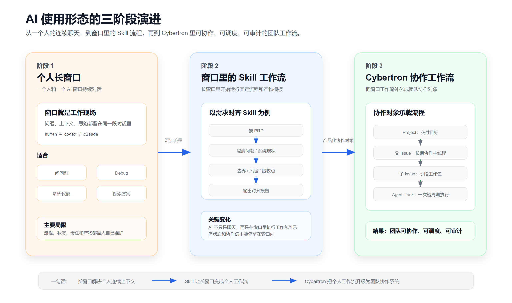

一句话：长窗口解决个人连续上下文，Skill 让长窗口变成个人工作流，Multica 把个人工作流升级成团队可协作、可调度、可审计的工作流。

## 核心分层

```text
Workspace
  -> Project: 一条需求 / 一个版本 / 一次交付目标
      -> 父 Issue: 需求交付的编排主线程
          -> 子 Issue: 阶段任务、产物任务、缺陷修复任务
              -> Agent Task: 某个 agent 的一次实际执行
```

各层职责：

| 层级 | 负责什么 | 不负责什么 |
| --- | --- | --- |
| Project | 表达业务需求、整体交付目标、负责人、优先级、整体进度、PRD/设计/测试/发布资源 | 不承载每个 agent 的具体执行状态 |
| 父 Issue | 作为这条需求的编排主线程，通常分配给  Squad Leader  | 不塞满每个阶段的所有执行细节 |
| 子 Issue | 承载一个明确阶段、一个明确产物、一个明确负责人和 review gate | 不代表整条需求是否最终完成 |
| Agent Task | 表示某个 agent 在某个 Issue 上的一次运行 | 不直接代表看板上的业务工作单元 |

一句话：Project 管“这条需求是什么”，Issue 管“哪项工作由谁做、做到哪一步”，Agent Task 管“一次 agent 实际运行”。

## 推荐协作流程

主流程：

```text
需求进入
  -> 创建 Project
  -> 固定创建父 Issue，分配给 Delivery Squad
  -> Squad Leader Agent 接管编排
  -> Leader 创建并指派需求对齐子 Issue
  -> 需求对齐 Agent 产出报告
  -> 人类 review 并 approve
  -> Leader 推进设计子 Issue
  -> 设计 Agent 产出设计文档
  -> 人类 review 并 approve
  -> Leader 推进编码子 Issue
  -> Coding Agent 实现
  -> Review Agent / 人类做代码审查
  -> 提测准备
  -> Test Agent 执行测试
  -> 人类研发确认测试报告
  -> 如有问题，由人类研发确认后拆 Fix 子 Issue
  -> Fix Agent 修复，Test Agent 回归
  -> 人类确认发布
  -> Release Agent 执行发布上线
  -> 人类最终确认，父 Issue done，Project completed
```

建议的阶段子 Issue：

| 子 Issue | 推荐 assignee | 核心产物 | 完成标准 |
| --- | --- | --- | --- |
| 需求对齐 | Req Agent | 需求对齐报告 | 人类确认需求边界、验收点、风险 |
| 技术设计 | Design Agent | design.md / 任务拆分 | 人类确认方案可执行 |
| 编码实现 | Coding Agent | 代码变更 / PR / 实现说明 | 代码完成并进入审查 |
| 代码审查 | Review Agent 或 Human Reviewer | review report / 修改建议 | 无阻断问题 |
| 提测准备 | Submit Agent | 提测文档 / 环境部署记录 | 可交给测试执行 |
| 测试执行 | Test Agent | 测试报告 | 测试通过或产出缺陷列表 |
| 缺陷修复 | Fix Agent | 修复说明 / patch / 回归结果 | 对应缺陷关闭 |
| 发布上线 | Release Agent | 发布记录 / 上线确认 | 发布完成且回归通过 |

## 完整示例：支付链路改造

假设有一个需求：**支付链路改造**。目标是接入新的风控校验，调整支付前置校验逻辑，并完成测试、修复和上线。

最终完成后，各层对象应该是下面这样的状态。

## Agent Task 的 A2A 运行模型

Multica 的 Agent 不是一个常驻的 Codex 聊天窗口，而是一份可被调度的角色配置。真正执行时，daemon 会为每一次 Agent Task 临时启动 Codex / Claude 等 AI 编程工具，任务结束后进程退出释放。

```text
Agent = 角色配置
Runtime = daemon × AI 编程工具
Agent Task = 一次真实执行

进程不是常驻的，
但任务上下文可以被保存和恢复。
```

普通使用 Codex 时，用户通常是在一个终端窗口里持续对话。Multica 的模型不同：

```text
Issue 分配给 agent / @agent / rerun
  -> 服务端创建 Agent Task
  -> daemon claim 任务
  -> daemon 准备 work_dir、上下文、skills、env、mcp_config
  -> daemon 启动 Codex 子进程
  -> Codex 完成这一轮工作
  -> daemon 上报 transcript、结果、token、session_id、work_dir
  -> Codex 进程退出
```

对于 Codex，启动形态类似：

```bash
codex app-server --listen stdio:// [daemon 默认参数] [agent custom_args]
```

其中 `custom_args` 来自 Agent 配置，会在每次启动 Codex 时追加到命令行末尾。它影响的是下一次任务启动时的 Codex 参数，不会影响已经运行中的进程。

Multica 通过下面这些信息恢复上下文：

| 上下文 | 存在哪里 | 用途 |
| --- | --- | --- |
| issue 标题、描述、评论、状态 | Multica 服务端 | agent 每次执行时重新读取协作事实 |
| task transcript / messages | task_message | 展示执行过程，支持追溯 |
| session_id | agent_task_queue | 尝试恢复上一轮 AI 会话 |
| work_dir | agent_task_queue / daemon 本地目录 | 复用代码目录、上下文文件和中间产物 |
| agent instructions / skills / mcp_config | agent 配置 | 每次执行前重新注入角色能力 |
| workspace/project context | workspace/project/issue 资源 | 告诉 agent 当前团队、项目和资源背景 |

A2A 在这个模型里不是多个 agent 在同一个聊天窗口里长聊，而是 agent 通过 Issue、Comment、Status、Sub Issue、Agent Task result 这些协作对象交接工作。例如 Leader Agent 创建设计子 Issue，Design Agent 执行并产出设计报告，人类 review 后 Leader 再推动 Coding Agent。

独立说明见 [Agent Task 的 A2A 运行模型](./agent-task-a2a-runtime-model.md)。

短周期执行模型的直观对比图见：

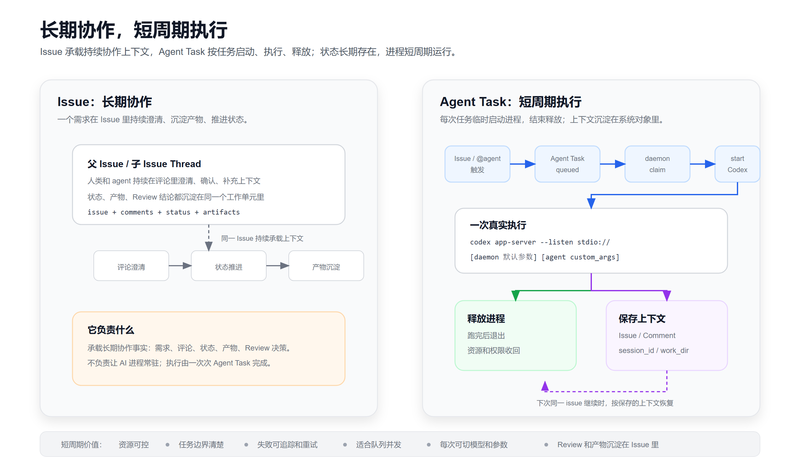

但长窗口并不是没有价值。它适合需求形成前的个人探索、连续澄清、debug 和方案草稿；当工作开始需要负责人、产物、状态、Review、失败重试和跨 agent 交接时，才应该沉淀为 Project / Issue / Sub Issue / Agent Task。

适用边界图见：

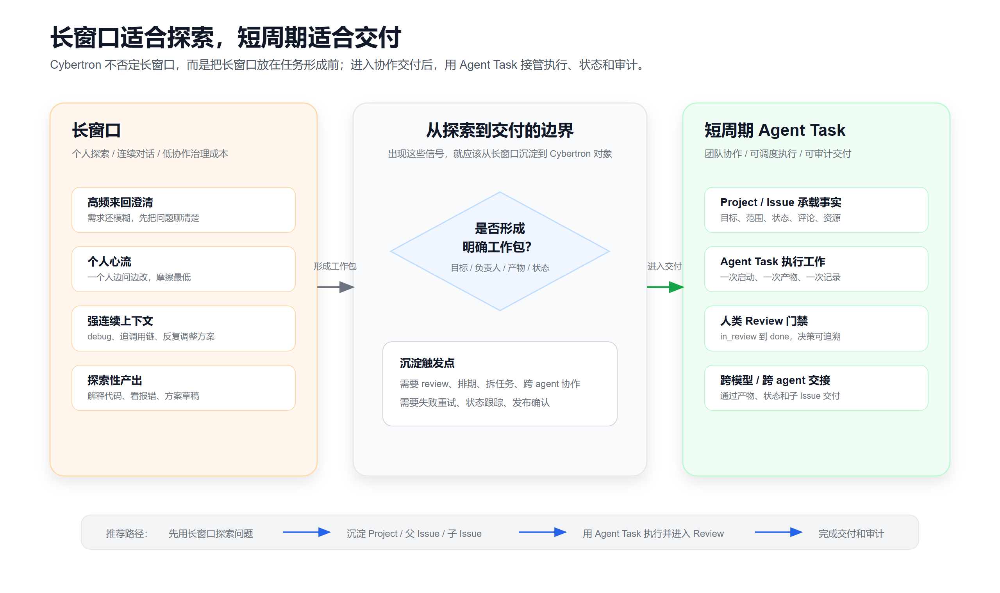

### Project 视角

```text
Project: 支付链路改造
status: completed
priority: high
lead: Delivery Squad
resources:
  - PRD: 支付链路改造 PRD
  - 需求对齐报告: req-alignment.md
  - 技术设计: design.md
  - 测试报告: test-report.md
  - 发布记录: release-note.md
progress:
  - total issues: 9
  - done issues: 9
```

Project 视角回答的是：这条需求整体是什么、谁负责、优先级如何、所有交付材料在哪里、整体是否完成。

### 父 Issue 视角

```text
父 Issue: 交付支付链路改造
status: done
assignee: Delivery Squad
实际协调者: Delivery Squad Leader Agent
project: 支付链路改造
child progress: 8/8
```

父 Issue 时间线里会看到一条完整编排轨迹：

```text
1. 人类创建父 Issue，并分配给 Delivery Squad
2. Squad Leader 创建“需求对齐”子 Issue
3. 需求对齐子 Issue done，系统通知父 Issue
4. Squad Leader 创建“技术设计”子 Issue
5. 技术设计子 Issue done，系统通知父 Issue
6. Squad Leader 创建“编码实现”子 Issue
7. 编码实现子 Issue done，系统通知父 Issue
8. Squad Leader 创建“代码审查”子 Issue
9. 代码审查子 Issue done，系统通知父 Issue
10. Squad Leader 创建“提测准备”子 Issue
11. 提测准备子 Issue done，系统通知父 Issue
12. Squad Leader 创建“测试执行”子 Issue
13. 测试执行发现 2 个问题，人类研发确认后拆 Fix 子 Issue
14. Fix 子 Issue 全部 done
15. Test Agent 回归通过，人类确认测试报告
16. Squad Leader 创建“发布上线”子 Issue
17. Release Agent 给出发布计划，人类确认发布
18. Release Agent 执行发布并记录结果
19. 人类最终确认，父 Issue done，Project completed
```

父 Issue 视角回答的是：整条需求是如何从一个阶段推进到下一个阶段的，每次推进的依据是什么。

### 子 Issue 视角

完成后，Project 下的子 Issue 可以长这样：

| 子 Issue | 状态 | Assignee | 主要产物 | 人类确认点 |
| --- | --- | --- | --- | --- |
| 需求对齐：支付链路改造 | done | Req Agent | req-alignment.md | PM/研发确认需求边界 |
| 技术设计：支付链路改造 | done | Design Agent | design.md | 研发负责人确认技术方案 |
| 编码实现：支付前置校验改造 | done | Coding Agent | PR / commit summary | 代码进入审查 |
| 代码审查：支付链路改造 | done | Review Agent | review report | 无阻断问题 |
| 提测准备：支付链路改造 | done | Submit Agent | 提测文档 / FAT 部署记录 | 测试可开始 |
| 测试执行：支付链路改造 | done | Test Agent | test-report.md | 人类研发确认测试结果 |
| Fix：风控拒绝码映射错误 | done | Fix Agent | fix summary / patch | 回归通过 |
| Fix：重复支付提示文案错误 | done | Fix Agent | fix summary / patch | 回归通过 |
| 发布上线：支付链路改造 | done | Release Agent | release-note.md | 人类确认后发布成功 |

注意：这里每个子 Issue 都可以有多次 Agent Task。例如“技术设计”可能第一次产出后被人类打回，Design Agent 根据评论再跑一次，最后人类把它从 `in_review` 改为 `done`。

### 看板视角

在需求进行中，看板可能是：

```text
backlog:
  - 发布上线：支付链路改造

todo:
  - 测试执行：支付链路改造

in_progress:
  - Fix：风控拒绝码映射错误

in_review:
  - 代码审查：支付链路改造

done:
  - 需求对齐：支付链路改造
  - 技术设计：支付链路改造
  - 编码实现：支付前置校验改造
```

全部完成后，看板里这个 Project 相关的工作都应该进入 `done`：

```text
done:
  - 交付支付链路改造
  - 需求对齐：支付链路改造
  - 技术设计：支付链路改造
  - 编码实现：支付前置校验改造
  - 代码审查：支付链路改造
  - 提测准备：支付链路改造
  - 测试执行：支付链路改造
  - Fix：风控拒绝码映射错误
  - Fix：重复支付提示文案错误
  - 发布上线：支付链路改造
```

看板视角回答的是：现在还有哪些工作包没完成、每个工作包在哪个状态、卡在哪个 review gate。

### Squad Leader 视角

Squad Leader Agent 的工作记录应该像一个调度日志：

```text
Round 1:
  观察：父 Issue 刚创建，需求还没有对齐产物。
  动作：创建“需求对齐”子 Issue，分配给 Req Agent。

Round 2:
  观察：需求对齐子 Issue done，报告已由人类确认。
  动作：创建“技术设计”子 Issue，分配给 Design Agent。

Round 3:
  观察：技术设计 done，方案已通过 review。
  动作：创建“编码实现”子 Issue，分配给 Coding Agent。

Round 4:
  观察：测试报告发现两个问题，人类研发已确认。
  动作：创建两个 Fix 子 Issue，分配给 Fix Agent。

Round 5:
  观察：Fix 完成，测试回归通过，人类确认可发布。
  动作：创建“发布上线”子 Issue，分配给 Release Agent。

Round 6:
  观察：发布完成，所有子 Issue done。
  动作：请求人类最终确认，随后父 Issue done，Project completed。
```

Leader 视角回答的是：为什么下一步是这个、为什么分配给这个 agent、为什么现在可以进入下一阶段。

### 专业 Agent 视角

每个专业 Agent 只需要关注自己负责的工作包：

```text
Req Agent:
  issue: 需求对齐：支付链路改造
  output: req-alignment.md
  status: done

Design Agent:
  issue: 技术设计：支付链路改造
  output: design.md
  status: done

Coding Agent:
  issue: 编码实现：支付前置校验改造
  output: PR / commit summary
  status: done

Test Agent:
  issue: 测试执行：支付链路改造
  output: test-report.md
  status: done

Fix Agent:
  issues:
    - Fix：风控拒绝码映射错误
    - Fix：重复支付提示文案错误
  output: fix summaries
  status: done

Release Agent:
  issue: 发布上线：支付链路改造
  output: release-note.md
  status: done
```

专业 Agent 视角回答的是：我负责哪个 Issue、我要产出什么、当前是否已经被人确认。

### 人类视角

人类在这个流程里主要做 review gate 和高风险确认：

```text
PM / 需求方:
  - review 需求对齐报告
  - 确认需求边界和验收标准

研发负责人:
  - review 技术设计
  - review 测试报告
  - 确认哪些测试问题需要拆 Fix
  - 最终确认需求完成

测试负责人:
  - review Test Agent 的测试报告
  - 确认回归通过

发布负责人:
  - review Release Agent 的发布计划
  - 确认允许执行发布
```

人类视角回答的是：我需要在哪些节点做判断，而不是每一步都盯 agent 执行。

## Issue 状态使用

当前 Issue 状态：

```text
backlog -> todo -> in_progress -> in_review -> done
                         \-> blocked
                         \-> cancelled
```

建议语义：

| 状态 | 建议含义 |
| --- | --- |
| backlog | 已规划但暂不触发 agent，适合等待前置阶段完成 |
| todo | 准备执行，分配给 agent/squad 后会触发工作 |
| in_progress | agent 正在执行或负责人正在处理 |
| in_review | agent 产物已交付，等待人类 review |
| done | 人类或 leader 判断该工作包通过 |
| blocked | 缺信息、缺权限、执行失败或需要人工介入 |
| cancelled | 工作包取消 |

### Review 通过与 Approve

当前 Multica 没有独立的 `approve` / `approved` / `APPROVED` 产品动作，Issue 状态选择器直接让用户选择 `backlog`、`todo`、`in_progress`、`in_review`、`done`、`blocked`、`cancelled`。

因此当前最佳实践是：

```text
子 Issue in_review
  -> 人类完成 review
  -> 人类把子 Issue 状态改为 done
  -> 这次 in_review -> done 的状态变化代表“已批准 / 已验收”
  -> 父 Issue 收到 child done 通知
  -> Squad Leader 被唤醒，判断下一步
```

这和现有机制最贴合：

- `in_review` 是等待人类确认。
- `done` 是人类或 leader 判断该工作包通过。
- 子 Issue 进入 `done` 后，平台已有父 Issue 通知和 leader 唤醒链路。

未来如果需要更强审计，可以在此基础上增加显式 **Approve 动作**，但它应该是一个动作，不应该新增一个看板列。建议语义：

```text
子 Issue in_review
  -> 人类点击 Approve
  -> 系统记录 approval 事件 / 评论 / activity
  -> 子 Issue 自动进入 done
  -> 父 Issue 收到 child done 通知
  -> Squad Leader 被唤醒，判断下一步
```

这样保留了两个维度：

- `in_review` / `done` 仍然是看板状态。
- `approved` 是人类确认动作和审计证据。

也就是说，当前用“改为 done”表达批准；未来可以用“Approve 按钮”把“记录批准证据 + 改为 done”封装成一个更明确的 review gate。

Project 状态只表达整体生命周期：

```text
planned -> in_progress -> paused / completed / cancelled
```

不要把 Project 状态细化成“需求对齐中、设计中、测试中”。这些阶段细节由子 Issue 表达，否则 Project 会变成过大的状态机。

## 父子 Issue 联动

当前更适合理解为“通知和触发联动”，不是“状态自动同步”。

已有联动：

1. 父 Issue 可以展示子 Issue 完成进度。
2. 子 Issue 从非 `done` 进入 `done` 时，系统会在父 Issue 上发 system comment。
3. 如果父 Issue 分配给 agent 或 squad，子 Issue 完成后会触发父 Issue 的 assignee：
   - 父 assignee 是 agent：唤醒该 agent。
   - 父 assignee 是 squad：唤醒 squad leader。
   - 父 assignee 是 human member：不自动触发，由人自己阅读。

不建议自动做的事：

- 不要因为所有子 Issue 完成就无脑把父 Issue 改成 `done`。
- 不要因为某个子 Issue `in_progress` 就自动改变父 Issue 状态。
- 不要把测试通过、发布完成这些判断折叠成单个子 Issue 的完成状态。

推荐规则：

```text
父 Issue = 编排状态
子 Issue = 执行状态
子 Issue done = 通知 / 唤醒父 Issue
父 Issue done = 人或 Leader 判断整条需求真的完成
```

这样可以避免误关单。例如测试子 Issue 完成了，但发布还没做，父 Issue 不应该自动 `done`。

## Agent Task 与 Issue 的关系

不要把 `Issue` 理解成一次 agent 调用。

更准确的关系：

```text
一个 Issue = 一个可被看板管理的工作单元
一次 Agent Task = 一个 agent 在该 Issue 上的一次运行
一个 Issue 可以有多次 Agent Task
```

例子：

```text
设计子 Issue
  -> Design Agent 第一次产出
  -> 人类 review 不通过
  -> 人类评论补充要求
  -> Design Agent 再跑一次
  -> 人类通过
  -> 子 Issue done
```

所以子 Issue 的粒度不应该是“一次 agent call”，而应该是“一个明确责任和明确产物的工作包”。

适合拆成子 Issue 的工作：

- 有明确产物。
- 有明确负责人。
- 需要人类 review。
- 可能反复迭代。
- 需要在看板上独立追踪。
- 失败后需要独立 fix 或回归。

不一定要拆子 Issue 的工作：

- 普通追问。
- 给同一个 agent 补充上下文。
- 对同一个产物的小修小改。
- 不需要独立状态和负责人追踪的讨论。

## Testing / Fix / Release 闭环

测试和修复应作为显式循环表达：

```text
Test Agent 执行测试
  -> 产出测试报告
  -> 人类研发确认测试报告
  -> 测试通过？
      -> 是：人类确认发布，推进发布上线子 Issue
      -> 否：人类研发拆 Fix 子 Issue
              -> Fix Agent 修复
              -> Test Agent 回归
              -> 人类研发再次确认测试报告
              -> 再判断是否通过
```

缺陷处理决策：

- Test Agent 只输出测试报告，不直接创建 Fix 子 Issue。
- 人类研发确认测试报告，判断问题是否真实、是否需要修复、如何拆缺陷。
- 确认后再创建 Fix 子 Issue，分配给 Fix Agent。
- Fix 完成后再回到 Test Agent 做回归。

这样可以避免 Test Agent 误判、重复拆单或把环境问题当成代码缺陷。

Release Agent 有发布权限，但必须在人类确认后执行发布。推荐语义：

```text
发布上线子 Issue in_review
  -> Release Agent 生成发布计划 / 待执行命令 / 风险说明
  -> 人类确认允许发布
  -> Release Agent 执行发布
  -> 发布完成后子 Issue done
```

当前没有独立的“Approve 发布”动作时，人类确认可以通过评论、状态推进或明确指令完成；未来可以封装成 `Approve release` 动作，统一记录批准人、批准时间、发布计划版本和执行结果。

## Leader Agent 的角色

Leader Agent 不应该亲自执行每个阶段的工作。它的职责是：

- 读取父 Issue 和最新时间线。
- 判断当前需求处于哪个交付阶段。
- 创建或推进下一批子 Issue。
- 把子 Issue 指派给合适的专业 agent。
- 在子 Issue 完成后，判断是否进入下一阶段。
- 在测试失败且人类研发确认后，协调创建和推进 fix 子 Issue。
- 在所有必要工作完成后，请求人类最终确认。

Leader Agent 典型动作：

```text
子 Issue done
  -> 平台通知父 Issue
  -> Leader 被唤醒
  -> Leader 读取 sibling 子 Issue 和父 Issue 时间线
  -> Leader 判断下一步
  -> 创建 / 推进后续子 Issue
```

## 建议画图方式

后续可以画三张图：

1. 端到端交付泳道图
   - 泳道：人类 Owner/Reviewer、Multica 看板、Leader Agent、Req/Design/Coding/Test/Fix/Release Agent、产物。
   - 重点：人审 gate、agent 产物、测试 fix loop、发布上线。

2. Project-Issue 层级图
   - 展示 Project、父 Issue、阶段子 Issue、fix 子 Issue、Agent Task 的层级关系。
   - 重点：Project 是业务容器，Issue 是工作包，Agent Task 是运行记录。

3. Testing/Fix/Release 状态机图
   - 展示测试通过进入发布，测试失败进入 fix loop，fix 后回归测试。
   - 重点：缺陷修复循环和最终发布确认。

## 已确认产品决策

以下决策来自当前讨论，后续画图和产品设计以此为默认口径：

1. 每个需求固定创建一个父 Issue。Project 是需求容器，父 Issue 是编排主线程。
2. Leader 是 Squad Leader Agent。父 Issue 分配给 Delivery Squad，由 squad leader 负责协调。
3. 当前人类 review 通过后，由人类把子 Issue 从 `in_review` 改为 `done`，这个状态变化就是批准。未来可增加 `Approve` 动作，封装“记录审计证据 + 自动改为 done”。
4. Test Agent 只输出测试报告。缺陷是否成立、如何拆 Fix 子 Issue，由人类研发确认。
5. Release Agent 有发布权限，但必须在人类确认后再执行发布。

## 图示版本

### 图一：端到端协作泳道

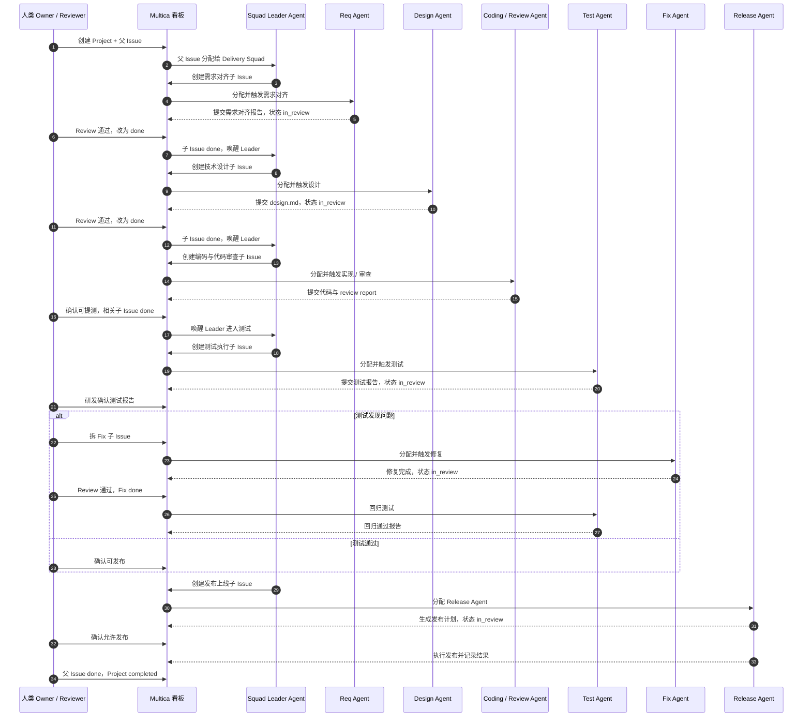

### 图二：Project / Issue / Agent Task 层级

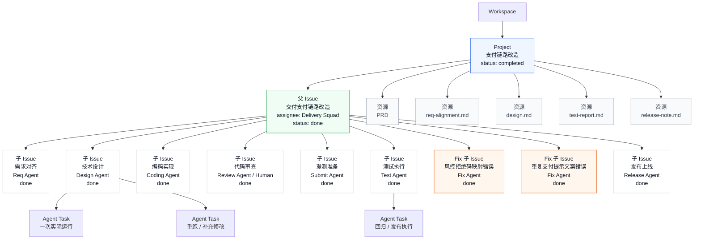

### 图三：测试 / Fix / 发布闭环

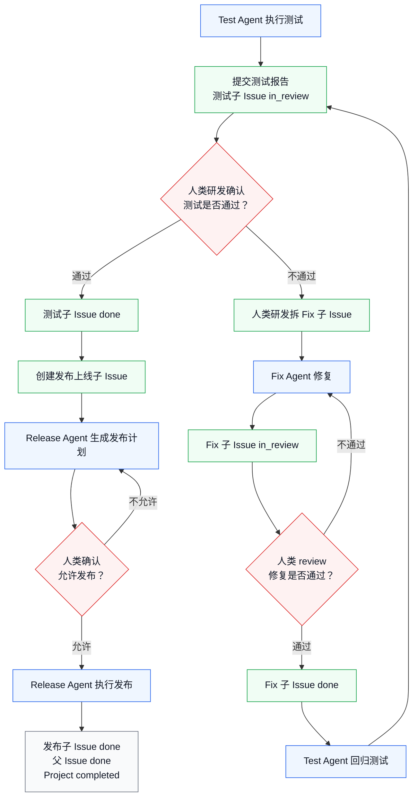

### 图四：Project 视角

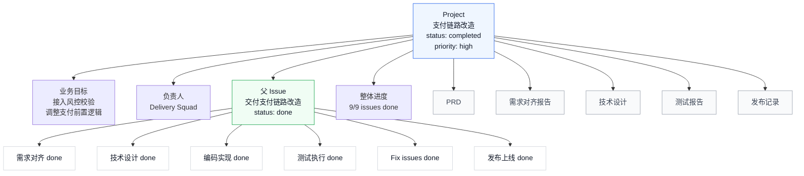

### 图五：父 Issue 视角

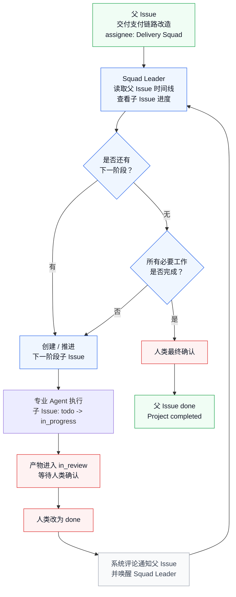

### 图六：子 Issue 视角

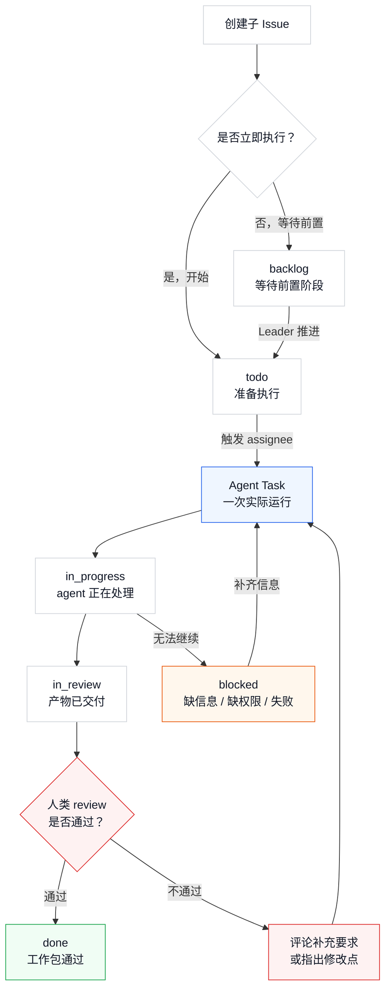

### 图七：看板视角

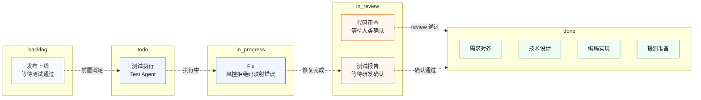

### 图八：Squad Leader 视角

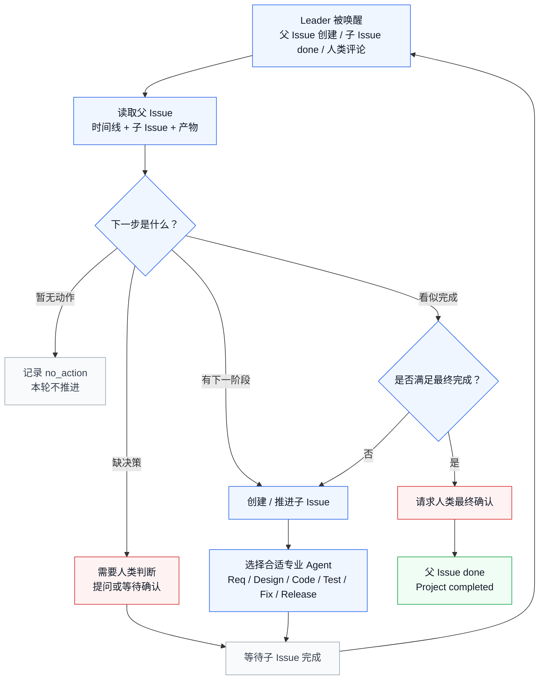

### 图九：专业 Agent 视角

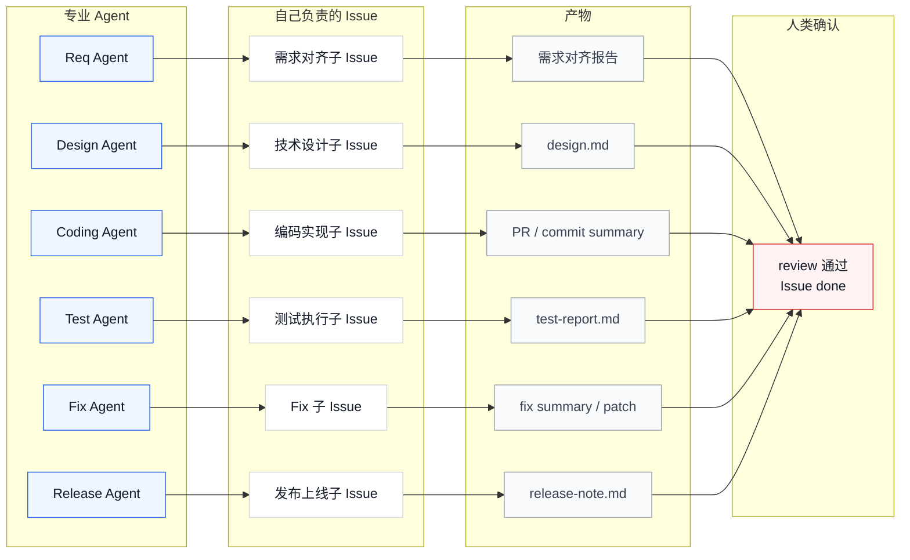

### 图十：人类 Reviewer 视角

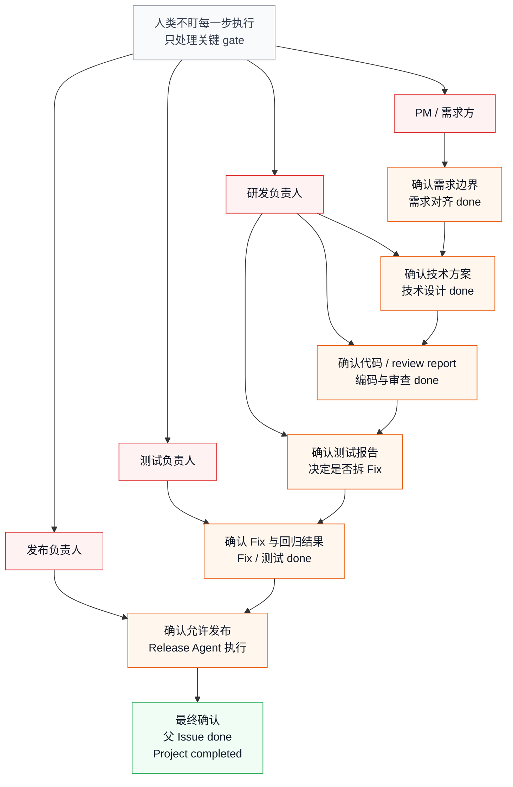
