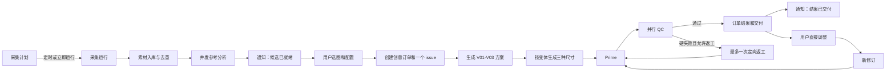
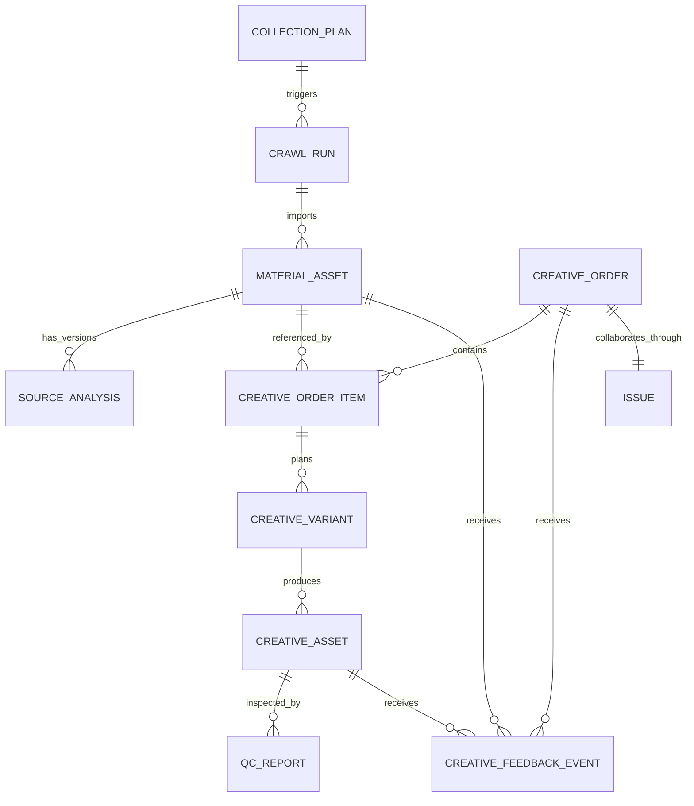
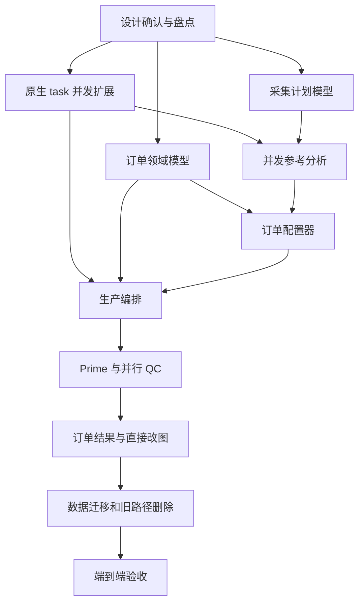

# 创意平台素材与生产工作流重构设计

状态：核心业务界面已实现，完整生成链路验收进行中
日期：2026-08-05
范围：素材采集、参考分析、创意配置、图片生产、Prime、QC、返工、交付和直接改图  

## 1. 结论

创意业务应当成为 Multica 上的一个领域工作台。业务页面展示素材、订单和结果，平台执行层保存智能体运行记录。

目标方案继续使用 Multica 原生的智能体、skill、自动化、执行任务、运行时、收件箱、附件和 issue。变化在于各对象只承担自己的职责：

- 自动化（Autopilot）负责定时和手动触发，不作为业务人员每天进入的页面。
- 智能体和 skill 负责判断与执行，不把广告业务规则写入通用任务服务。
- Agent Task 继续作为智能体运行单位。Crawl Run、订单、变体和阶段记录聚合 task 状态，平台不增加 Task Batch 或 Work Unit。
- issue 负责需要人参与的目标、决策、反馈和验收，不再记录每张素材、每个变体和每次 QC 调用。
- 创意平台保存素材、分析、订单、版本、质量报告和交付关系，给业务人员稳定的操作界面。
- 收件箱只提醒"可以选图"、"需要处理"、"已经交付"等需要注意的事件。

按默认流程，一次采集 25 张图片不会创建 25 个 issue。用户选中多张素材并开始生产时，默认只创建一个创意订单 issue。后台可以运行几十个独立 task，但这些 task 通过执行详情查看，不占用 issue 看板。

## 2. 为什么要重构

### 2.1 当前模型混合了三类信息

现有流程同时把 issue 当成：

1. 业务人员的工作入口；
2. 智能体的并发队列；
3. 过程证据和文件的存储位置。

因此一次普通生产会出现素材分析 issue、单图工作 issue、V01-V03 issue、Prime issue、QC issue 和返工 issue。它们都能留痕，但业务人员很难判断该看哪一个、哪个状态代表最终状态、为什么父 issue 仍在等待。

### 2.2 "所有过程都留痕"不等于"所有过程都建 issue"

Multica 已经有多层记录能力：

- `autopilot_run` 记录自动化触发；
- `agent_task_queue` 和 `task_message` 记录智能体运行、工具调用和输出；
- 附件和领域记录保存输入、版本和结果；
- `activity_log` 记录业务动作；
- issue 和评论记录人机协作。

把每个内部动作再复制成 issue，只会增加噪声，不会增加真正的可追溯性。

### 2.3 当前 issue 状态语义不稳定

Prime 和 QC issue 按某个范围完成后，又可能因为新尺寸或返工再次运行。此时 `done` 不再表示任务已经结束。父子 issue 的完成率也无法表达"V01 已交付，V02 QC 失败，V03 仍在出图"。

### 2.4 当前 UI 暴露了实现细节

业务人员会看到子 issue 编号、智能体委派、工作流名称和自动评论，但真正需要的信息是：

- 今天采到了哪些新素材；
- 哪些素材值得选；
- 推荐文案为什么合适；
- 每个变体进行到哪一步；
- 哪些结果可用，哪些需要处理；
- 如何调整某一张图。

新设计围绕这些问题组织页面。

## 3. 设计原则

### 3.1 平台原生，不建立第二套调度系统

创意平台复用 Multica 的认证、权限、自动化调度、任务队列、运行时、智能体、skill、附件、事件和收件箱。它不会另建创意专用 cron、进程池或模型会话系统。

### 3.2 领域数据由领域模型表达

素材、参考分析、文案快照、创意订单、变体、尺寸、QC 报告和交付物都有稳定结构。页面不再从 issue 标题、评论文本或文件名猜测业务状态。

### 3.3 issue 只表达可协作、可验收的工作

只有当一项工作需要负责人、业务讨论、用户反馈、截止时间或验收时才创建 issue。机器内部的并发项继续使用现有 task。

### 3.4 Skill 决定做法，平台原语保证执行

Skill 描述分析方法、变体差异、图片一致性、Prime 规则和 QC 标准。平台只提供版本固定、批量提交、并发限制、依赖通知、重试、取消和结果登记。

### 3.5 先交付可用结果，再汇总整批状态

一个变体通过 QC 后立即进入订单结果。某个变体失败，不阻塞同一素材的其他变体；某张素材失败，也不阻塞同一订单的其他素材。

### 3.6 默认简单，保留高级入口

标准生产提供稳定默认值。用户仍可换文案、补充想法、只改一个变体、只补一个尺寸、使用历史素材或直接用自然语言改图。高级能力放在明确入口中，不要求普通用户先理解智能体拓扑。

## 4. 目标业务流程



### 4.1 采集阶段

1. 业务人员在"创意工厂 > 素材库 > 采集计划"中配置来源、竞品、市场、数量、频率和凭证。
2. 采集计划在后台映射到普通自动化，使用 `run_only` 模式。
3. 定时触发或点击"立即运行"后，系统创建采集运行记录，不创建 issue。
4. 采集智能体按 skill 执行真实采集，结果进入素材库并去重。
5. 新素材按分析批次并发提交给参考分析智能体。
6. 分析完成或达到可用终态后，系统通知用户候选已就绪。

没有新素材时，只结束本次采集运行，不创建 issue，也不发送普通提醒。凭证失效时，运行进入 `action_required`，收件箱链接到同一套凭证验证页面。

#### 本次运行可见性与分析状态

素材库必须保留一次 Crawl Run 的边界：用户点击“立即运行”后自动展开本次新增素材，关闭后可再次打开；
该视图以 `run_id` 和 `is_new_in_run=true` 查询，不能混入历史复用素材。图片和非图片分别计数，只有图片
参与参考分析分母。

图片状态从关联分析 task 派生为“分析排队中”“分析中”“已完成分析”或“分析失败”。已完成的图片可在
本次运行视图直接选择，写入与完整素材库相同的候选决定事件，并自动定位到订单草稿的逐块文案配置；
分析未完成或非图片素材不能进入选择。失败项保留在本次运行视图中，并可单项重试。

Collector 在提交分析 fanout 前必须验证当前运行时 CLI 支持 `multica task fanout`。旧 CLI 只要无法提交
fanout，就必须把采集 task 标记为明确失败，不能把已入库的素材误报为“预分析已完成”。具体业务操作见
[投放素材协作使用说明](./creative-material-workflow-guide.md)。

采集计划映射到 Multica 原生 Autopilot。Autopilot 是触发器，创建原生 Autopilot Run，并且必须配置
`assignee_type=agent` 和采集智能体 `assignee_id`。当前 bootstrap 使用 `run_only`，把“印尼竞品素材周度采集”
绑定到 AppGrowing 素材采集智能体。未绑定 agent 的 Autopilot 不能作为采集计划发布。采集智能体负责创建
Crawl Run 和提交分析 Agent Task，Autopilot 本身不保存素材业务状态。

### 4.2 选图与配置阶段

1. 用户在候选视图中筛选、预览和多选素材。
2. 每张素材显示来源短 ID、分析摘要、识别文案、视觉机制和推荐文案。
3. 用户选择推荐文案、其他已审核文案或自定义文案，并填写主题方向和补充创意想法。
4. 页面保存的是创意订单草稿，此时不创建 issue，也不触发生产。
5. 用户点击"开始生成"后，系统固定所有输入版本，创建一个创意订单 issue，并分配给素材小队 Leader。

### 4.3 生产阶段

Leader 第一次运行时读取订单快照和当前小队能力，生成本次执行计划。平台按批次提交已经就绪的 task，批次结束时只唤醒一次 Leader，不按每个工作项反复唤醒。

每张入选素材的默认生产单元如下：

```text
创意规划：一次输出 V01、V02、V03 三套差异明确的变体说明
  ├─ V01 生产：方形底图 -> 横版与竖版原生重排
  ├─ V02 生产：方形底图 -> 横版与竖版原生重排
  └─ V03 生产：方形底图 -> 横版与竖版原生重排

每个变体三张底图齐备后：
  Prime 三张 -> 技术 QC 与视觉 QC 并行 -> 合并结论 -> 交付或返工
```

方形底图不先经过独立 Prime 和 QC。横版、竖版以同一变体的方形底图和变体说明为约束，保证三个尺寸表达同一个创意，只改变构图和尺寸。

### 4.4 交付与调整阶段

- 任一变体通过 QC 后立即展示三种尺寸，不等待其他变体。
- 订单结果页按"素材 > 候选变体 > 尺寸"组织结果；V01-V03 是候选，不是三个正式交付。
- 每个订单条目只能采用一个完整变体，`adopted_variant_id` 是页面、Issue 摘要和下载的唯一正式结果来源。
- 采用后的三个尺寸组成"交付包"。用户可以下载单图或完整交付包；未采用变体保留为历史候选，不进入正式下载。
- Creative Order 负责输入快照、生产、QC 和采用状态；交付包是订单的输出视图，不新增第二种"交付订单"实体。
- 切换采用变体需要明确确认并记录历史反馈，不能静默覆盖业务已经使用的方案。
- 用户对结果提出调整时，系统创建新的订单修订和新 task，不复用已经完成的批次。
- 如果订单 issue 已经是 `done`，提交调整会先明确重开为 `in_progress`，不会在 `done` 状态下静默运行智能体。

## 5. 产品信息架构

创意平台提供五个业务视图。它们使用独立领域路由和数据，但仍在同一个 Multica 工作区、权限和导航体系内。

| 页面 | 业务问题 | 核心内容 |
| --- | --- | --- |
| 工作台 | 现在需要我做什么 | 待选素材、待验收或需处理订单、最近交付 |
| 素材库 | 今天采到了什么、哪些值得使用 | 采集计划、采集运行、素材筛选、分析和订单草稿 |
| 创意订单 | 生成到了哪里、最终采用哪个 | 业务阶段、局部失败、变体验收、调整、采用和下载 |
| 品牌与市场规则 | 生产依据是什么 | 文案库、市场规则、Prime 组件、二维码、品牌和合规资料 |
| 数据反馈 | 哪些推荐和规则需要优化 | 素材采用率、文案采用率、一次通过率、QC 反馈和高频原因 |

普通业务人员从工作台进入素材库和创意订单；品牌与市场规则和数据反馈也使用业务语言，允许有权限的业务人员自行维护。通用自动化、智能体、Squad 和 Skill 页面仍保留给高级管理与排障。

### 5.1 采集计划不是新的调度器

"采集计划"是通用自动化在创意业务中的领域投影。它展示业务需要的字段：

- 来源连接器；
- 凭证状态；
- 竞品和筛选条件；
- 市场资源包；
- 目标采集量；
- 时区和执行频率；
- 上次运行、下次运行和"立即运行"。

通用"自动化"页面仍保留，供管理员查看原始触发器、并发策略和运行历史。业务人员无需从这里开始每天的爬图任务。

### 5.2 创意订单配置器

每个已选素材占一行或一个可展开区域，包含：

- 参考图片和来源短 ID；
- AI 分析摘要，只读；
- 推荐的已审核文案及推荐理由；
- 可搜索的其他文案；
- 自定义文案；
- 创意主题或视觉方向；
- 补充创意想法；
- 高级分析证据，默认折叠。

"开始生成"按钮固定订单输入并创建 issue。选图、改文案和填写想法不会产生 issue 评论。

### 5.3 订单进度

默认页面显示业务阶段，不显示子 issue 编号：

```text
订单 3/6 个变体已交付

素材 MAT-7F3A
  V01  已交付
  V02  QC 检查中
  V03  需要处理：竖版严重破图
```

点击"执行详情"后才显示智能体、关联 task、运行耗时、工具调用和错误。完成 Skill 快照能力后，该处再展示
执行时的 Skill 发布版本和内容 hash；当前只能展示 agent 的现有绑定，不能把它当作历史执行证据。业务
状态与执行证据来自同一数据链，不依赖自动评论同步。

候选全部就绪后，订单进入"待采用"，而不是直接显示"交付完成"。采用完成后，订单顶部固定显示正式方案、
原图对比、三个尺寸、资源包版本和交付包下载；其他候选默认折叠。一个订单包含多张素材时，每张素材分别
采用一个变体，全部条目采用后订单才进入"已交付"。

### 5.4 原图与成图对比工作区

订单页把原图对比作为主操作区，不把图片缩在九宫格里。用户点击任一结果后进入接近全屏的图片工作区：

- 默认使用左右双栏，左侧原图约占 30%，右侧正式成图是主要检查区域；窄屏改为上下排列；
- 两侧使用原始分辨率资源，列表缩略图不进入对比工作区；
- 成图支持缩放和拖动，滚轮事件限定在画布内，不带动整页滚动；
- 工具栏提供适应窗口、放大、缩小，并把变体、尺寸和底图/Prime 切换压缩在同一行；
- 不提供滑杆和叠加模式，避免遮挡、认知负担和无效工具占位；
- 变体和尺寸使用分段控件切换，切换不会离开订单；
- 对比数据明确区分候选原图、模型生成底图和 Prime/QC 后正式成图；用户可以在"原图与正式成图"和
  "底图与 Prime 成图"之间切换；
- 支持连续创建多个点标注或框选标注，拖动过程中实时显示范围，每处标注都可以填写问题类型、作用范围和调整说明；
- QC 警告和用户标注显示在对应图片旁，不遮挡关键画面；
- 桌面端支持全屏查看，窄屏按上下排列并保留单图切换。

图片容器使用稳定宽高和 `object-contain`，不得裁切原图或成图。系统先显示清晰预览，再按需加载原始文件；加载原图时保留画布尺寸，避免页面跳动。

### 5.5 市场资源包与 Prime 自助管理

Prime 不是必须包含固定角标的一张图片，而是市场资源包中的可选组件集合。内置组件包括 Logo、条款、
二维码、应用商店标识、监管说明、AFPI 和 Pindai Legal，业务用户也可以新增自定义组件。每个组件可以
独立启停，并按方形、横版和竖版配置模板来源区域与成图位置。

资源包页面提供"标注模板"和"调整成图"两个视图。业务用户在画布上框选和拖动，不直接维护
`hard_regions`、`backdrop_rule` 或二维码像素坐标。发布服务根据启用组件编译 Prime 合成清单、避让区域、
背景要求和 QC 契约。二维码支持 `none`、`static` 和 `dynamic` 三种模式；`none` 不要求二维码文件、地址或
QC，`static` 保留模板内容，`dynamic` 才执行地址审批、生成和解码校验。

页面编辑与自然语言配置最终调用同一套资源包草稿、验证和发布 API。已发布版本只影响之后创建的订单，
运行中订单继续使用冻结快照。Skill 只实现通用合成算法，不包含国家名称、固定 AFPI 要求或市场坐标。

## 6. Multica 原生对象如何分工

| Multica 对象 | 在创意平台中的职责 | 默认是否展示给业务人员 |
| --- | --- | --- |
| 自动化 | 采集计划的调度和手动触发 | 只展示领域化采集计划 |
| 自动化运行 | 一次采集触发的原始记录 | 在采集运行详情中可查看 |
| 智能体 | 采集、分析、规划、生产、Prime、QC、直接改图 | 展开执行详情后展示 |
| Skill | 各角色的工作契约和确定性工具 | 在资源与执行详情中展示版本 |
| Agent Task | 一次智能体执行，也是后台并发的最小调度单位 | 默认隐藏 |
| Issue | 创意订单的协作、反馈和验收 | 展示 |
| 评论 | 用户决策、反馈、阻塞说明和最终总结 | 展示 |
| 附件 | 输入参考、执行证据和输出文件 | 按领域关系展示 |
| 收件箱 | 候选就绪、需要处理、交付完成 | 展示 |
| 活动记录 | 业务动作的审计记录 | 在活动时间线展示 |

这仍然符合 Multica"人和智能体在同一个工作系统里协作"的设计。平台不要求每一次智能体运行都变成 issue；`run_only` 自动化和独立 task 本来就是原生能力。

对象边界按以下规则固定：

- Crawl Run 和 Creative Order 是创意平台业务域对象，分别聚合采集分析和生产交付状态；
- 每个 Creative Order Item 保存一个最终采用变体；交付包由该变体的正式资产派生，不建立 Delivery Order；
- Agent Task 是 Multica 原生后台执行对象，负责并发、归因、取消、重试和运行证据；
- 一个 Creative Order 关联一个用户协作摘要 Issue，内部分析、规划、生产、Prime 和 QC 不创建 Issue；
- Task Batch 和 Work Unit 不进入目标模型，也不增加对应 API、表或管理页面。

## 7. Issue 创建边界

### 7.1 默认规则

| 场景 | 是否创建 issue | 原因 |
| --- | --- | --- |
| 定时采集 | 否 | 机器运行，无需人工协作 |
| 手动立即采集 | 否 | 仍是采集运行 |
| 25 张素材参考分析 | 否 | 并发执行项，不是 25 个业务目标 |
| 候选就绪 | 否 | 收件箱通知即可 |
| 订单草稿和选图 | 否 | 用户尚未提交工作 |
| 点击"开始生成" | 是，一个订单一个 issue | 有明确目标、负责人和验收 |
| 每张素材、每个变体、Prime、QC | 否 | 使用 task 和领域状态 |
| 用户调整一个结果 | 默认复用订单 issue | 属于同一交付目标的新修订 |
| 单独上传图片并要求改图 | 是 | 形成新的可验收请求 |
| 凭证失效 | 默认否 | 先用 `action_required` 通知；需要多人协作时可转 issue |

### 7.2 何时拆分多个订单 issue

只有以下情况才拆分：

- 不同素材由不同负责人验收；
- 交付日期或市场不同；
- 用户明确选择"拆分为独立订单"；
- 某个异常需要跨团队长期处理。

素材数量本身不是拆分条件。

### 7.3 评论规则

写入评论的内容：

- 用户确认的重大变更；
- 用户反馈和自然语言调整要求；
- 需要用户处理的阻塞；
- 部分交付或最终交付摘要；
- 人或智能体的判断和争议。

不写入评论的内容：

- "V02 开始生成"；
- "Prime 已完成 3/9"；
- 每条内部 task 的完成回执；
- 可由结构化状态直接展示的信息。

## 8. 使用原生 task 并发

### 8.1 平台已有能力

`syncV0.4.7` 已经通过 `agent_task_queue`、智能体 `max_concurrent_tasks` 和守护进程总并发运行多条 task。task 还保存委派、系统重试、人工重跑和触发证据：

- `delegated_from_task_id`；
- `retry_of_task_id`；
- `rerun_of_task_id`；
- `trigger_evidence_kind` 和 `trigger_evidence_ref_id`。

这些字段足以记录分析、生产、Prime 和 QC 的执行来源。平台不增加 `task_batch`、`work_unit` 或对应管理页面。

### 8.2 需要补充的通用 task 能力

现有调度器允许同一智能体并发执行多条 task，但会串行同一 issue、同一智能体的 task，也会把没有 issue、聊天或自动化来源的 task 当作 quick-create 串行处理。创意流程需要两项小扩展：

1. TaskService 提供原子批量入队方法，一次提交多条普通 task；
2. 认领逻辑根据 task 上下文识别真正的 quick-create，让带领域触发证据的 direct task 按智能体并发上限运行。

订单提交时固定两类执行输入。`squad_snapshot` 按 capability 解析 Leader 和七个专业角色的 agent ID；
市场资源快照固定已发布市场包版本、结构化 config、文案快照、Prime、App UI 和品牌附件。领域服务把本次
task 所需字段复制到 task context，队列在创建时固定目标 `agent_id` 和 `runtime_id`。角色改名、成员顺序
变化或市场包后续发布新版本不会改变已提交订单。

批量入队只写入多条原生 Agent Task，不创建聚合执行实体。每条 task 固定以下内容：

```text
agent_id / runtime_id
context.type          # creative_analysis | creative_production | creative_prime | creative_qc
context.input         # 当前素材、变体或 QC 范围
trigger_evidence_kind # creative_candidate | creative_variant | creative_order
trigger_evidence_ref_id
delegated_from_task_id
agent_role_snapshot   # 本订单 capability -> agent_id 映射
resource_snapshot_ref # 订单内不可变资源快照及版本
```

当前快照仍有两个边界。agent 快照固定身份、capability 映射和 task runtime，不保存整份可变 Agent 指令。
`agent_task_queue` 也没有不可变的 Skill 文件快照；运行时仍可能读取 agent 当时绑定的当前 Skill。bootstrap
中的 Skill `config.version` 只能帮助审计，不能证明 task 执行了哪一份文件。上线前需要给 task 保存
`skill_id`、发布版本、内容 hash 和文件清单，执行详情再展示该快照。完成这项能力前，页面不得宣称“每条
task 已固定 Skill 版本”。

### 8.3 业务对象负责聚合

- Crawl Run 根据本轮候选的分析状态展示 `18/25 已分析`；
- 创意订单根据条目和变体状态展示规划、生产、Prime、QC 和交付进度；
- 变体根据三个尺寸资产和两路 QC 报告判断是否可交付；
- 失败 task 的重试沿用 `retry_of_task_id`，领域对象保留当前尝试和历史尝试关系。

用户在 Crawl Run 或订单中点击"取消阶段"、"重试失败项"和"查看执行详情"。领域服务查询关联 task 并执行操作，用户无需管理内部 task 分组。

Creative Order 通过 `workflow_failures` 暴露失败执行，字段包括：

```text
task_id / agent_id / workflow / scope / subject_id / item_key
trigger_evidence_kind / trigger_evidence_ref_id
failure_reason / error / failed_at / retryable
```

订单有失败时，`derived_status` 显示 `action_required`，详情页在等待成图区域上方展示失败步骤和完整原因。
用户可以对 `retryable=true` 的来源执行一次人工重试。平台调用按来源重试接口，只重建失败 task，并用
`retry_of_task_id` 保留链路。一个失败来源只有一次人工重试机会；第二次失败后按钮关闭，订单保留已通过
结果并等待用户调整输入、放弃该项或新建修订。图片 provider 对 408、429、5xx 的传输层短退避属于同一
task 尝试，不占用这次人工恢复机会。

### 8.4 Issue 数量和并发方式

- 一次采集创建一个 Crawl Run，不创建 issue；
- N 张素材分析创建 N 条 direct task，按分析智能体并发上限运行；
- 一次正式生产创建一个订单 issue；
- V01-V03 生产 task 可以并发，方形完成后横版和竖版并发；
- Prime 和两路 QC 使用 direct task，不创建子 issue；
- 不同素材和变体互不阻塞，领域页面持续展示已完成结果。

### 8.5 删除未发布的 Work Unit 草稿

当前工作区中尚未发布的 Work Unit 草稿绑定了 backlog issue，还会在全部项目结束后修改 issue 状态。实施时删除以下内容：

- `/api/issues/{id}/work-units`；
- `work_unit` 上下文、类型和 CLI；
- migration 253 的 Work Unit 专用索引；
- 批次结束后修改 issue 状态的逻辑。

可以保留的实现思路包括原子创建多条 task、幂等项目键和守护进程的单项上下文注入，但代码必须落回通用 TaskService 和现有 task 模型。

## 9. 领域数据模型

### 9.1 主要实体



| 实体 | 作用 | 关键字段 |
| --- | --- | --- |
| `collection_plan` | 创意业务中的采集计划 | autopilot_id、connector、filters、market_pack、credential、target_count |
| `creative_material_crawl_run` | 一次采集运行 | plan_id、状态、计数、错误、开始和结束时间 |
| `creative_material_candidate` | 已入库来源素材 | source_id、短 ID、媒体、去重键、来源信息、库状态 |
| `creative_source_analysis` | 市场中立的参考分析版本 | 检测文本、语义、机制、布局、视觉锚点、证据、分析 skill 版本 |
| `creative_order` | 用户提交的生产目标 | issue_id、状态、生产策略、资源快照、创建人 |
| `creative_order_item` | 订单中的一张参考素材 | material_id、analysis_version、文案快照、方向、用户想法、修订 |
| `creative_variant` | V01-V03 中的一个创意 | 变体说明、内容约束、状态、修订 |
| `creative_asset` | 某个变体尺寸的底图或正式成图 | variant_id、size_key、stage、attachment_id、lineage |
| `creative_qc_report` | 技术或视觉质检结论 | variant_id、lane、检查项、警告、硬失败、证据 |
| `creative_feedback_event` | 用户对素材、推荐和成图的结构化反馈 | subject、decision、reason_codes、annotation、上下文快照、用户和时间 |

### 9.2 拆分当前 CreativeBrief

当前 `CreativeBrief` 同时保存图片事实、市场适配和用户决定，导致分析结果与文案选择互相污染。目标模型拆成两部分。

`SourceAnalysis` 只记录参考图事实：

- 检测到的文字；
- 画面主题和传播机制；
- 布局、视觉和配色锚点；
- App UI 类型；
- 可追溯证据和置信度；
- 分析智能体与 skill 版本。

`CreativeOrderItemBrief` 记录本次生产决定：

- 文案记录及其不可变快照；
- 主利益点和辅助利益点；
- 主题和视觉方向；
- 必须保留和允许变化的内容；
- 用户补充想法；
- 选中的 App UI 参考；
- 市场资源包和生产策略快照。

参考分析可以被多个订单复用。换文案或换市场不会篡改历史分析。

### 9.3 交付关系必须结构化

`candidate_id`、`order_item_id`、`variant_key`、`size_key`、`revision`、`stage`、`Prime` 和 `qc_report_id` 必须存成字段。文件名只用于下载展示，不能再负责识别变体或尺寸。

## 10. 文案选择和推荐

文案库很难与竞品图逐字对应，系统不应要求完全匹配。推荐发生在订单配置阶段，使用两个输入：

1. `SourceAnalysis` 提取的传播机制和利益点；
2. 当前市场资源包绑定的已发布文案库。

推荐结果包含：

- 推荐文案；
- 匹配维度，如免息、期限、额度、速度或信任；
- 与参考图的差异；
- 合规状态；
- 推荐理由。

例如竞品表达"1 个月免息"，而文案库只有通用免息文案，系统推荐最接近的已审核免息文案，并明确"保留免息机制，但不承诺 1 个月"。这不是错误，也不应在设计阶段阻塞用户。

选择顺序为：

1. 语义和事实都匹配的已审核文案；
2. 机制相同、事实更保守的已审核文案；
3. 其他已审核文案，由用户选择；
4. 用户自定义文案，按市场政策决定是否需要审核。

文案差异在配置页面说明。生产智能体只使用订单固定的文案快照，不再根据参考图自行补写金融事实。

## 11. Prime、QC 与返工

### 11.1 执行粒度

- Prime：一条 task 处理一个变体的三种尺寸，使用同一版市场资源包。
- 技术 QC：一条 task 检查一个变体的三种尺寸。
- 视觉 QC：一条 task 同时读取一个变体的三种尺寸，检查内容一致性和图片质量。
- 两路 QC 并行，聚合器合并结果。

这样既能分工提速，也能让 QC 比较同一变体的三张图是否只是尺寸和构图不同。

### 11.2 QC 重点

技术 QC 检查：

- 文件可读性和实际尺寸；
- Prime 资产版本和四角贴片；
- 二维码是否可解码；
- 品牌、条款和命名规则；
- 交付关系和文件完整性。

视觉 QC 检查：

- 严重破图、文字乱码、肢体或物体异常；
- 竞品品牌或 App UI 残留；
- 获批文案是否被改变；
- 同一变体三种尺寸的主题、主体、文案和核心视觉是否一致；
- Prime 硬区是否真的遮挡关键内容。

QC 不应因为参考图本身已有主体靠近边角就直接失败。只有贴片实际遮挡关键内容或违反明确硬规则时才判硬失败。一般构图风险记录为警告并允许交付。

### 11.3 返工策略

- QC 不自动返工。软警告直接交给用户判断，硬失败进入 `action_required`。
- 用户可以发起一次定向返工，按受影响变体和尺寸创建新 revision，只重做失败项。
- 新 revision 再次失败后停止模型调用，保留已通过结果，用户可以接受风险、继续人工编辑或放弃该变体。
- Agent Task 执行失败的人工重试和 QC 创意返工分别计数，两者的上限均为一次。

## 12. 直接改图与业务灵活度

标准生产 skill 不适合承担所有自由编辑。增加独立的"图片编辑智能体"，绑定轻量直接改图 skill，使用同一图片模型能力，但不要求生成三套变体或完整生产流程。

用户可以从三处调用：

- 在创意订单的成图查看器点击"调整"，选择当前尺寸或整个变体并输入自然语言；
- 在素材库选择一张图，点击"直接改图"；
- 在普通 issue 中附图并 `@图片编辑智能体` 描述要求。

直接改图的默认行为：

1. 固定原图、参考图和用户描述；
2. 生成一张或指定尺寸的结果；
3. 保存 task、提示词、模型请求和附件；
4. 若来源是创意订单，登记为该资产的新修订；
5. 只有用户选择"作为正式投放素材"时，才继续 Prime 和 QC。

这条路径提供灵活性，同时不破坏标准订单的版本和质量记录。

## 13. 透明度和审计

透明度分三层展示。

### 13.1 业务审计

业务页面和订单 issue 记录：

- 谁选了哪些素材；
- 谁确认了文案、主题和补充想法；
- 使用了哪些市场资源版本；
- 谁提出了调整；
- 哪些结果被接受、放弃或交付；
- 哪个问题需要人处理。

### 13.2 执行审计

执行详情记录：

- 关联 task 及其委派、重试和重跑链；
- 智能体、运行时，以及有快照时的 Skill 发布版本和内容 hash；
- 开始、结束、排队和失败时间；
- 工具调用、模型请求 ID、输入和输出；
- 重试、取消和并发限制。

### 13.3 资产血缘

每张正式成图可以追溯到：

```text
来源素材
  -> 参考分析版本
  -> 文案和市场资源快照
  -> 订单条目和修订
  -> 变体说明
  -> 三尺寸底图
  -> Prime 版本
  -> QC 报告
  -> 正式交付
```

用户默认看第一层，需要排查时再进入后两层。留痕没有减少，只是放到了正确的位置。

### 13.4 用户反馈进入日常操作

创意平台在用户做选择时保存反馈，不在流程结束后要求用户补填问卷。每类对象使用明确状态：

| 对象 | 用户动作 | 记录内容 |
| --- | --- | --- |
| 候选素材 | 浏览、加入候选、采用、明确拒绝、归档 | Crawl Run、排名、分析版本、决定和拒绝原因 |
| 推荐文案 | 展示、接受、换成其他文案、编辑、自定义 | 推荐列表与顺序、被选文案、修改前后差异和原因 |
| 创意变体 | 接受、要求调整、放弃 | 变体说明、决定、原因和调整范围 |
| 正式成图 | 查看对比、接受、下载、调整、报告问题 | 尺寸、修订、问题类型、图片标注和文字说明 |
| QC 结论 | 接受警告、报告漏检、报告误判 | QC 版本、用户判断和对应画面区域 |

系统不能把“没有选择”当成“不喜欢”。候选素材需要区分 `unseen`、`viewed`、`shortlisted`、`selected`、`rejected` 和 `archived`。推荐文案必须记录用户实际看到的选项和顺序，避免只统计最终选择造成偏差。

拒绝和调整原因使用可复用代码，用户也可以填写补充说明：

- 素材：重复、无关、画质低、构图不适合、文字或利益点不适合、竞品元素难替换、App UI 不适合、其他；
- 文案：利益点不匹配、事实不适用、表达不自然、语气不合适、过长、合规风险、翻译问题、其他；
- 成图：文案错误、主题偏离、主体不一致、尺寸间内容不一致、品牌或 Prime 问题、破图、竞品残留、其他。

拒绝操作保持轻量：用户点击拒绝后选择一个原因标签即可，补充说明可选。用户可以撤销决定，平台保留撤销前后的事件。

### 13.5 图片问题标注

原图对比工作区允许用户在成图上添加点标记或矩形区域，再选择问题类型并输入修改要求。标注保存相对坐标、目标资产版本和当前缩放无关的数据。用户提交后可以选择作用范围：

- 当前尺寸；
- 当前变体的三种尺寸；
- 同一订单全部变体。

直接改图智能体和返工流程读取这些结构化标注。新修订完成后，页面保留旧图、旧标注和处理结果，用户可以确认问题是否解决。

### 13.6 数据结构与优化规则

`creative_feedback_event` 使用追加写入，不覆盖历史。每条事件保存：

```text
workspace_id
actor_id
subject_type / subject_id
event_type
decision
reason_codes
comment
annotation_json
context_snapshot   # Crawl Run、分析、推荐、文案、市场包、Skill 和修订版本
created_at
```

领域表同时保存当前状态，页面不需要回放全部事件才能渲染。平台先聚合反馈供团队复盘，不自动把单次反馈写回 skill 或模型提示词。负责人审核聚合结果后，再发布新的采集策略、文案、市场资源或 skill 版本。

第一阶段提供以下指标：

- 各采集计划、竞品和筛选条件的素材采用率；
- 分析推荐分数与用户实际采用的偏差；
- 文案推荐接受、替换和修改比例；
- 各变体的接受、调整和放弃比例；
- QC 漏检、误判和用户接受警告比例；
- 返工原因、次数和最终解决率。

后续可选接入“是否实际投放”和投放表现。该数据单独授权和导入，不从下载动作推断投放成功。

## 14. 通知策略

收件箱只发送以下事件：

- 候选素材已就绪；
- 采集凭证或关键资源需要处理；
- 订单有部分结果可用，可选是否提醒；
- 订单存在无法自动处理的失败；
- 订单全部完成；
- 用户关注的直接改图完成。

不发送以下事件：

- 每张素材分析开始或完成；
- 每个变体、尺寸、Prime 或 QC task 完成；
- Leader 的每次内部唤醒；
- 没有新素材的正常采集运行。

通知应聚合更新同一个收件箱条目，避免一个订单产生几十条消息。

## 15. 并发、容量和故障隔离

### 15.1 并发控制

平台同时遵守三层限制：

- 守护进程总 task 并发；
- 单个智能体并发；
- 同一 provider 凭证的模型并发。

领域服务只提交可运行的 task，调度器按实际槽位认领。业务配置中的"10 并发"不是每个智能体都拥有 10 个独立槽位，而是上限之一。图片 provider 的硬上限必须单独控制，429 进入受控退避，不能让整个订单失败。

### 15.2 故障隔离

- 单个分析失败不阻止其他素材进入候选池；
- 单个变体失败不阻止其他变体 Prime、QC 和交付；
- 单个尺寸返工不重做已通过尺寸；
- 一个订单失败不占用或覆盖另一订单的结果；
- 迟到 task 只能写入其固定 revision，不能覆盖新修订；
- 恢复窗口按 task 类型配置，长图片任务不使用短文本 task 的超时口径。
- 订单直接展示失败 workflow、原因和可恢复动作；用户最多重试一次失败来源，其他分支继续交付。

### 15.3 幂等键

关键动作使用稳定幂等键：

- 采集：`plan_id + scheduled_at`；
- 分析：当前使用 `material_id + analysis_revision`，完成 Skill 快照后加入 `skill_snapshot_id`；
- 规划：`order_item_id + revision`；
- 生产：`variant_id + revision`；
- Prime：`variant_id + revision + prime_snapshot_id`；
- QC：`variant_id + revision + lane`。

## 16. 服务和前端边界

### 16.1 服务端

服务端负责：

- 领域记录、权限、版本快照和幂等；
- 调用 TaskService 批量入队普通 task；
- 接收结构化智能体结果；
- 聚合领域状态和发出事件；
- 生成收件箱通知；
- 保护迟到结果和修订边界。

服务端不负责：

- 写死 V01-V03 的创意内容；
- 编写图片提示词；
- 直接调用 LLM；
- 在 issue 服务中实现广告专用状态机。

默认三变体、三尺寸和 QC 策略来自版本化生产策略。Leader 和相关 skill 读取该策略生成执行计划。

### 16.2 前端

- 服务器状态继续由 TanStack Query 管理；
- 筛选、选择篮、未提交订单草稿等客户端状态放在 `packages/core/` 的 Zustand store；
- 业务页面放在 `packages/views/creative/`，Web 和 Desktop 共用；
- API 响应使用 Zod 解析并提供回退，不能因旧服务缺字段白屏；
- WebSocket 事件使领域查询失效，不直接写 Zustand。

## 17. 迁移方案

### 阶段 0：冻结旧模型

- 不再扩展"一图一 issue"和"Prime/QC 子 issue"能力。
- 当前运行服务继续用于现有验收，删除未发布的 Work Unit 草稿。
- 本文评审通过后，把旧文档标记为已被本文取代，而不是继续维护两套目标流程。

### 阶段 1：补齐原生 task 并发入口

- TaskService 支持原子批量入队 direct task。
- 调整 quick-create 串行判定，允许带领域证据的 task 按智能体上限并发。
- 使用现有触发证据、委派、重试和重跑字段，不新增执行实体。
- 领域服务提供按来源取消、重试和查询执行详情的操作。

### 阶段 2：把采集和分析移出 issue

- 建立采集计划和自动化映射。
- 采集运行直接写素材库。
- 参考分析使用 direct task 并行执行，Crawl Run 聚合候选分析状态。
- 候选就绪改为领域通知。

### 阶段 3：建立创意订单模型

- 拆分 SourceAnalysis 与 OrderItemBrief。
- 建立订单、条目、变体、资产、QC 和版本血缘。
- 将文案、市场资源包、App UI、Prime 和 capability 到 agent 的映射固定为不可变快照。
- 给 Agent Task 增加 Skill 发布版本和内容 hash 快照，补齐当前执行审计缺口。

### 阶段 4：替换业务 UI

- 新建工作台、素材库、订单配置器、生产进度、采用下载和数据反馈。
- issue 详情只嵌入订单摘要、反馈和验收入口。
- 执行证据放入按需展开的执行详情。

### 阶段 5：重写创意 skills

- 采集 skill 写入 Crawl Run 和素材库；
- 分析 skill 写入 SourceAnalysis；
- Leader skill 面向 Creative Order，并委派普通 task；
- 规划、生产、Prime、QC skills 输出结构化领域结果；
- 删除创建大量子 issue、自动评论进度和复用已完成 issue 的协议。

### 阶段 6：迁移数据并删除旧路径

- 回填现有素材、分析、订单和交付关系；
- 将可识别的历史文件名解析为结构化字段并固定结果；
- 移除 `creative_issue_context`、`creative_issue_item` 对旧工作流的强绑定；
- 移除 issue 元数据和标题驱动的状态判断；
- 移除旧候选池在 issue 详情中的生产职责。

本项目尚未正式上线，不保留两套内部业务路径。跨 Web/Desktop 和新旧服务版本的 API 边界仍按仓库兼容规则处理。

## 18. 任务拆分

任务按依赖顺序排列。大小用于比较工作量，不是工期承诺。

### A. 架构与清理

| ID | 任务 | 产出 | 大小 | 依赖 |
| --- | --- | --- | --- | --- |
| CP-001 | 评审并确认本设计 | 决策记录、保留项和非目标 | S | 无 |
| CP-002 | 盘点当前创意数据和未发布改动 | 表、API、事件、Skill、脚本和可迁移数据清单 | M | CP-001 |
| CP-003 | 标记旧流程文档状态 | 旧文档指向本文，避免双重事实来源 | S | CP-001 |
| CP-004 | 冻结旧 issue 原生扩展 | 不再向旧候选池和子 issue 流程增加能力 | S | CP-001 |

### B. 原生 task 并发扩展

| ID | 任务 | 产出 | 大小 | 依赖 |
| --- | --- | --- | --- | --- |
| PLAT-101 | 删除 Work Unit 草稿 | 删除专用 endpoint、context、CLI、索引和 issue 状态联动 | M | CP-001 |
| PLAT-102 | 实现 direct task 批量入队 | 在一个事务内创建多条原生 task，保留人类归因和委派来源 | L | PLAT-101 |
| PLAT-103 | 调整 task 认领规则 | 只串行真正的 quick-create，领域 direct task 按智能体上限并发 | M | PLAT-102 |
| PLAT-104 | 实现按领域来源查询与取消 | 使用触发证据查询、取消排队或运行中的 task | M | PLAT-102 |
| PLAT-105 | 实现失败项重试 | 订单展示失败原因，人工最多重试一次，复用 `retry_of_task_id` 且不重跑成功项 | M | PLAT-104 |
| PLAT-106 | 接入 provider 槽位 | 总并发、智能体并发和凭证并发统一生效 | L | PLAT-103 |
| PLAT-107 | 提供执行详情 API 和响应 schema | 领域页面读取 task、消息、耗时和重试链 | M | PLAT-104, PLAT-105 |
| PLAT-108 | 原生 task 并发测试 | 事务、并发、归因、幂等、取消、迟到结果和异常响应 | L | PLAT-103, PLAT-106, PLAT-107 |

### C. 素材库与采集

| ID | 任务 | 产出 | 大小 | 依赖 |
| --- | --- | --- | --- | --- |
| MAT-201 | 建立采集计划模型 | 采集配置与普通自动化的一对一映射 | M | CP-002 |
| MAT-202 | 改造自动化触发 | `run_only` 创建 Crawl Run，支持立即运行 | M | MAT-201 |
| MAT-203 | 统一凭证预检 | 设置页验证与真实采集使用同一服务结果 | M | MAT-202 |
| MAT-204 | 完善素材入库 | 去重、来源短 ID、归档、人工上传和运行关联 | L | MAT-202 |
| MAT-205 | 建立 SourceAnalysis 版本模型 | 市场中立分析、证据和 skill 快照 | M | CP-002 |
| MAT-206 | 并发参考分析 | 一次创建 N 条 direct task，不创建 issue，由 Crawl Run 聚合 | L | PLAT-108, MAT-204, MAT-205 |
| MAT-207 | 候选聚合与通知 | 部分成功、终态、无新增和 `action_required` 规则 | M | MAT-206 |
| MAT-208 | 素材库 UI | 采集计划、运行、候选筛选、短 ID、选择篮 | L | MAT-203, MAT-207 |

### D. 创意订单与生产

| ID | 任务 | 产出 | 大小 | 依赖 |
| --- | --- | --- | --- | --- |
| CRE-301 | 建立订单领域模型 | Order、Item、Brief、Variant、Asset、QC、Revision | L | CP-002 |
| CRE-302 | 实现 Agent 与资源快照 | capability 到 agent、文案、市场包、App UI、Prime 和策略版本固定 | L | CRE-301 |
| CRE-303 | 实现文案推荐 | 基于 SourceAnalysis 和已发布文案库返回推荐与差异 | M | MAT-205, CRE-302 |
| CRE-304 | 实现订单配置器 | 多图配置、完整文案、补充想法、草稿和高级项 | L | CRE-303 |
| CRE-305 | 创建订单 issue | 点击开始生成时一单一 issue，并建立领域关联 | M | CRE-304 |
| CRE-306 | 重写 Leader 编排 | 按订单状态批量委派，批次结束只唤醒一次 | L | PLAT-108, CRE-302, CRE-305 |
| CRE-307 | 重写创意规划 | 单素材一次输出 V01-V03 结构化变体 | M | CRE-306 |
| CRE-308 | 重写图片生产 | 每个变体一条 direct task，方形后并发横竖版 | L | CRE-307 |
| CRE-309 | 重写 Prime | 每个变体批量处理三种尺寸并登记资产版本 | M | CRE-308 |
| CRE-310 | 拆分并行 QC | 技术和视觉两路检查，聚合硬失败与警告 | L | CRE-309 |
| CRE-311 | 实现一次定向返工 | 只处理失败变体和尺寸，不阻塞其他结果 | L | CRE-310 |
| CRE-312 | 实现增量交付 | 单变体通过即进入订单结果，不阻塞其他变体 | M | CRE-310 |
| CRE-313 | 实现生产进度 UI | 业务阶段、部分交付、需要处理和执行详情 | L | CRE-306, CRE-312 |
| CRE-314 | 实现高清对比工作区 | 原图窄栏、成图主画面、画布缩放、连续标注和版本切换 | L | CRE-312 |

### E. 用户反馈与数据闭环

| ID | 任务 | 产出 | 大小 | 依赖 |
| --- | --- | --- | --- | --- |
| DATA-401 | 设计反馈事件和原因代码 | 候选、文案、变体、成图和 QC 的统一事件契约 | M | CP-001 |
| DATA-402 | 扩展现有反馈表 | 当前状态、追加事件、上下文快照、撤销和查询 API | L | DATA-401 |
| DATA-403 | 接入候选决策 | 未看、浏览、入选、采用、拒绝和归档，拒绝原因轻量采集 | M | MAT-208, DATA-402 |
| DATA-404 | 接入文案推荐反馈 | 记录推荐曝光、顺序、接受、替换、编辑和原因 | M | CRE-303, DATA-402 |
| DATA-405 | 接入成图与 QC 反馈 | 接受、调整、放弃、漏检、误判和图片区域标注 | L | CRE-314, DATA-402 |
| DATA-406 | 提供反馈指标 | 采集采用率、文案接受率、变体调整率和 QC 反馈 | M | DATA-403, DATA-404, DATA-405 |

### F. 直接改图

| ID | 任务 | 产出 | 大小 | 依赖 |
| --- | --- | --- | --- | --- |
| EDIT-401 | 创建图片编辑智能体和 skill | 自然语言改图，不继承标准三变体流程 | M | CP-001 |
| EDIT-402 | 实现结果和素材入口 | 当前尺寸、整个变体、素材库直接改图 | M | CRE-301, EDIT-401 |
| EDIT-403 | 支持普通 issue 调用 | 附图并 `@图片编辑智能体`，结果作为附件和可选修订 | M | EDIT-401 |
| EDIT-404 | 接入正式交付 | 用户选择后才执行 Prime 和 QC | M | CRE-309, CRE-310, EDIT-402 |

### G. 迁移与删除

| ID | 任务 | 产出 | 大小 | 依赖 |
| --- | --- | --- | --- | --- |
| MIG-501 | 编写数据回填 | 素材、分析、文案快照、交付和修订迁入新模型 | L | CRE-312, MAT-207 |
| MIG-502 | 替换 issue 嵌入组件 | 订单摘要、反馈和验收替代旧候选池与子 issue 进度 | L | CRE-313 |
| MIG-503 | 删除旧流程代码 | 删除旧 issue 编排、自动进度评论和文件名推断 | L | MIG-501, MIG-502 |
| MIG-504 | 更新文档和内置 skills | 产品说明、使用指南和 source map 与实现一致 | M | MIG-503 |

### H. 验收与发布准备

| ID | 任务 | 产出 | 大小 | 依赖 |
| --- | --- | --- | --- | --- |
| QA-601 | 真实业务视角端到端验收 | 从页面建计划、采集、选图、生产、调整到下载 | L | MIG-504 |
| QA-602 | 并发与 429 验收 | 10 路总并发、图片槽位、退避和跨订单隔离 | M | QA-601 |
| QA-603 | 故障场景验收 | 凭证失效、无新增、分析部分失败、QC 失败和迟到结果 | L | QA-601 |
| QA-604 | Web/Desktop 回归 | 共享视图、响应兼容、刷新和 WebSocket 更新 | M | QA-601 |
| QA-605 | 对比与反馈交互验收 | 高清加载、画布缩放、多处标注、拒绝原因和撤销 | M | QA-601 |
| QA-606 | 首次用户可用性验收 | 只通过页面完成配置和生产，不使用 CLI、数据库或人工补数据 | L | QA-601 |
| QA-607 | 真实 provider 完整运行 | 单素材完整 3x3 和多素材并发，运行中不修改代码或 skill | L | QA-602, QA-603 |
| QA-608 | 生成验收证据 | 步骤、预期、实际、截图、订单 ID、task 记录和问题结论 | M | QA-604, QA-605, QA-606, QA-607 |
| QA-609 | 发布检查 | 迁移、回滚、Skill 发布、智能体绑定和运行配置清单 | M | QA-608 |

## 19. 实施顺序与并行关系



可以并行的工作：

- task 并发扩展、采集计划模型和订单数据模型可在接口确定后并行；
- 素材库 UI 可在 API schema 固定后与订单后端并行；
- 直接改图 skill 可提前开发，但正式交付要等 Prime 和 QC 接口；
- Web/Desktop 共用业务视图，路由接线可并行处理。

不能提前做的工作：

- 不应在原生 task 并发入口完成前继续堆叠子 issue 方案；
- 不应在结构化资产关系完成前重写结果看板；
- 不应在数据回填验证前删除旧表和旧读取路径；
- 不应在真实业务端到端验收前发布新的默认流程。

## 20. 验收标准

### 20.1 对业务人员

- 从创意平台页面可以建立采集计划并立即运行，不需要进入通用自动化页面。
- 一次采集 25 张素材不会产生 25 个 issue 或 25 条通知。
- 候选图有稳定短 ID，能与参考分析一一对应。
- 选文案时能看完整文案、推荐理由、差异和补充创意输入。
- 点击开始生成后默认只出现一个订单 issue。
- 进度按素材、变体和阶段展示，任何已通过变体立即可见。
- 用户不打开子 issue 也能看懂失败原因并采取操作。
- 订单失败区域显示 workflow 和真实错误；可恢复项只允许一次人工重试，其他变体继续显示结果。
- 可以对一张结果直接输入自然语言调整。
- 用户能以原图窄栏和成图主画面比较细节，画布缩放不带动页面，并能连续圈选多处问题填写调整说明。
- 用户拒绝素材、替换推荐文案或调整成图时，能用轻量原因标签留下反馈。
- 用户能在图片上标记问题区域，并指定调整当前尺寸或整个变体。

### 20.2 对平台和智能体

- 采集、分析、生产、Prime 和 QC 全部由普通智能体与已绑定 skill 执行。
- 每条 direct task 都有输入、输出、运行时和消息证据；Skill 快照完成后还需展示发布版本和内容 hash。
- 一条 task 失败不影响同一 Crawl Run 或订单中的其他项目进入终态。
- Leader 只在阶段聚合状态需要决策时运行，不接收每张图的评论轰炸。
- `done` task 不复用；新修订创建新 task。
- 迟到结果不能覆盖新修订。
- 并发受守护进程、智能体和 provider 三层限制约束。

### 20.3 对质量和资产

- 同一变体三种尺寸使用同一文案、主题、主体和核心视觉。
- QC 分别输出技术结论和视觉结论，并能比较三个尺寸的一致性。
- 四角 Prime、二维码、尺寸、品牌和文件完整性有确定性证据。
- 软警告不导致无止境返工；自动返工上限不超过一次。
- 每张交付图都能沿结构化字段回溯完整血缘，不依赖文件名。

### 20.4 按使用者行为验收

最终验收使用业务账号从页面开始，不允许先用 CLI、数据库脚本或后台 API 构造成功状态。验收人员按以下顺序操作：

1. 在设置中绑定并验证采集凭证；
2. 在素材库中创建采集计划并点击立即运行；
3. 从收件箱进入本次候选素材；
4. 预览素材，明确拒绝一张并填写原因，选择至少一张进入订单；
5. 查看推荐文案，分别验证接受、替换或自定义操作；
6. 填写补充创意想法并开始生成；
7. 刷新页面、离开后返回，确认进度和结果不丢失；
8. 在部分结果就绪时查看，不等待整单结束；
9. 使用高清对比工作区检查三种尺寸，添加一个图片问题标注；
10. 发起一次定向调整，确认旧修订和新修订都可追溯；
11. 接受结果并下载单图、单变体和整单文件；
12. 查看反馈记录和执行详情，确认没有额外分析或 Prime/QC issue。

开发验收分三层：

- 自动化 UI 测试覆盖确定性的页面、状态、反馈和异常交互；
- 真实 provider 冒烟覆盖采集、分析、生成、Prime、QC 和调整；
- 人工视觉验收检查桌面与窄屏图片清晰度、文字截断、重叠和操作可理解性。

真实完整运行期间不得修改代码、skill、数据库、task 状态或结果文件。流程失败后，开发人员记录失败证据、修复实现，再从新的 Crawl Run 和订单重新开始。修复旧运行记录不能计入通过。

### 20.5 交付门槛

向业务验收交付前必须满足：

- 所有自动化测试通过；
- 单素材 3x3 真实流程无人工干预完成；
- 多素材并发流程证明分析和出图同时运行且未创建额外 issue；
- 凭证失效、无新增、429、分析部分失败、QC 失败和迟到结果都有页面可恢复路径；
- 验收报告为每项要求提供截图、业务对象 ID 和关联 task；
- 保留一个已验证的采集计划和干净入口，用户可以直接从页面再跑一遍。

## 21. 本轮不做

- 不新增创意专用模型网关或调度器。
- 不把采集分页拆成大量 direct task；采集连接器自己管理分页。
- 不为每个分析、变体、尺寸、Prime 和 QC 创建 issue。
- 不让普通用户配置任意工作流节点图。
- 不在第一阶段建设投放效果归因和自动学习闭环。
- 不同时维护旧 issue 流程和新订单流程作为两套长期模式。

## 22. 需要产品确认的两项策略

其余边界按本文直接实施，只保留两个会影响业务规则的选择：

1. 自定义文案是否可以直接进入正式投放生产。建议默认允许预览，正式交付前要求文案状态为已审核。
2. 部分变体交付时是否立即发送收件箱提醒。建议页面实时展示，收件箱只在首次可用和整单完成时各聚合一次。

## 23. 与现有文档的关系

本文通过评审后，将取代以下文档中的目标架构和默认业务流程：

- [Issue 原生广告创意协作](./issue-native-creative-workflow.md)
- [投放素材协作使用说明](./creative-material-workflow-guide.md)
- [创意素材协作流程提效方案](./creative-workflow-performance-plan.md)

旧文档中的实测性能数据、Prime 硬规则和历史问题仍可作为迁移参考，但"一图一 issue"、"Prime/QC 子 issue"和"父 issue 承载候选池"的设计不再作为目标形态。

## 24. 当前智能体和 Skill 审计

### 24.1 Bootstrap 拓扑

当前 bootstrap 创建 8 个创意角色。Squad 用 `leader_id` 绑定 Leader，并把另外 7 个专业智能体登记为成员。
周度采集 Autopilot 使用 `run_only`，明确绑定采集智能体；该配置符合原生 Autopilot 必须由 agent 执行的
约束。

| 角色 | Agent / Skill | 当前单 Agent 并发 | 结论 |
| --- | --- | ---: | --- |
| 协作与恢复 | 素材小队 Leader / 创意素材协作 | 2 | 保留。负责创建方案 task、人工恢复、订单摘要和最终验收，不执行专业工作 |
| 素材采集 | AppGrowing 素材采集智能体 / AppGrowing 素材采集 | 2 | 保留。负责连接器分页、Crawl Run 和分析 fanout |
| 参考分析 | 广告参考分析智能体 / 广告参考分析 | 6 | 保留。使用 Luna 低思考读取真实像素，输出市场中立 Source Analysis |
| 创意规划 | 生成方案智能体 / 广告生成方案 | 3 | 保留。消费已确认文案和资源快照，产出 V01-V03 |
| 底图生产 | 图像编辑智能体 / 广告图像编辑 | 3 | 保留。生成方形母版并重排横竖版，登记同一 asset family |
| 直接改图 | 图片直接修改智能体 / 广告图片直接修改 | 2 | 保留。承接自然语言自由修改，不走标准三变体规划 |
| Prime | Prime 包装智能体 / Prime 完整贴图 | 3 | 保留。执行确定性品牌资产、二维码和条款合成 |
| QC | 广告验收智能体 / 广告成图验收 | 6 | 保留。一个角色执行两个独立 task lane，分别写 technical 和 visual report |

这些数值是单 Agent 上限。守护进程总并发和 provider 槽位仍会降低实际并发，不能把表中的数字相加后
当作一个 token 可同时运行的 task 数。bootstrap 已给分析角色使用 `gpt-5.6-luna`，其余图片和判断角色
使用 `gpt-5.6-terra` 或运行时默认模型，没有使用不存在的通用 `gpt-5.6` 名称。

8 个角色的责任边界成立，当前无需合并角色。技术 QC 和视觉 QC 保持两个 Agent Task，即使它们使用同一
验收智能体。这样可以并发执行、独立失败和保存两份报告，同时避免再增加一个只做相同工具调用的 Agent。

### 24.2 Skill 可读性

Skill 的主要读者是执行智能体，工作区管理员也需要审查职责、输入、输出、风险和版本差异。每个 Skill
顶部应控制在一页内，包含角色边界、输入、成功条件、失败条件和允许的 handoff。CLI 示例、JSON schema、
坐标规则和确定性脚本参数放入 `references/`，由顶部契约链接。平台页面展示摘要和版本，管理员需要时再
打开完整文件。

当前文件行数为：Leader 217、Production 109、Plan 105、QC 103、Analysis 99、Prime 77、Direct Edit 71、
Collector 30。行数本身不构成问题，重复规则和可变配置占据正文才会增加维护成本。

### 24.3 审计发现

| 发现 | 现状 | 处理方向 |
| --- | --- | --- |
| 重复编排 | Leader 描述整条链，Plan、Production、Prime 又各自重复 by-source 查询、`item_key`、Issue 禁令和下一阶段 fanout | 抽出共享 task envelope、幂等和 handoff 契约；各角色只保留自己创建的下一跳 |
| Agent 指令过长 | bootstrap 的 Agent instructions 再次复制 Skill 中的尺寸、委派和失败规则 | Agent instructions 只保留身份、禁止越权项和 Skill 入口；执行细节由已发布 Skill 提供 |
| 可变策略硬编码 | V01-V03、三尺寸、图片模型、batch `max_concurrency=2`、AppGrowing 页数和一次返工分散在 Skill 与 bootstrap | 把变体数、尺寸、模型、provider 槽位、返工预算和连接器预算放入版本化生产策略或 task context |
| Skill 快照缺口 | 订单固定 agent ID 和资源，task 没有 Skill 内容 hash；执行详情却准备展示 Skill 版本 | task 创建时保存 Skill 发布版本、hash 和文件清单，daemon 按快照执行 |
| Agent 定义快照范围有限 | task 固定 `agent_id` 和 `runtime_id`，未保存整份 instructions、model 和 thinking 配置 | 保存最小 Agent execution snapshot，至少包含配置版本和 hash |
| 旧文档冲突 | 三份旧指南仍描述 Autopilot 创建父 Issue、候选池和 Prime/QC 子 Issue | 在旧文档首行加 superseded 标记和本文链接；历史实测章节保留只读 |
| 通用 direct edit 缺口 | 当前 direct edit 只接受 Creative Order 的 base asset、variant 和 revision | 增加普通 Issue 附件入口，创建通用图片编辑 task；用户选择正式投放后再导入 Creative Order 并走 Prime/QC |
| 失败恢复预算未形成统一契约 | 订单已能展示 `workflow_failures` 和调用按来源重试，重试次数仍需服务端统一约束 | 服务端按原 task 链计算一次人工重试预算，UI 只展示服务端 `retryable` 结论 |

### 24.4 分阶段治理任务

| 阶段 | ID | 任务 | 验收结果 |
| --- | --- | --- | --- |
| 1. 收敛共同契约 | SKL-701 | 新建共享 creative task envelope 和 handoff reference | 8 个 Skill 不再重复字段、幂等、Issue 边界和 by-source 规则 |
| 1. 收敛共同契约 | SKL-702 | 精简 bootstrap Agent instructions 与 Skill 首页 | Agent 指令只描述角色；每个 Skill 首页可在一次屏幕滚动内看懂输入、输出和禁区 |
| 1. 收敛共同契约 | DOC-703 | 给旧创意流程文档加 superseded 标记 | 搜索旧文档时先看到本文入口，不会按父子 Issue 模型新建流程 |
| 2. 策略配置化 | POL-711 | 建立版本化生产策略 | 变体数、尺寸、模型、并发、返工预算从订单快照读取 |
| 2. 策略配置化 | POL-712 | 把采集页数和预算移入 collection plan | Collector Skill 不含具体竞品页数，Crawl Run 保存实际策略版本 |
| 3. 执行可复现 | PLAT-721 | 增加 Skill 和最小 Agent execution snapshot | task 详情显示 ID、版本、hash；修改 Skill 后旧 task 仍按原快照重放 |
| 3. 执行可恢复 | PLAT-722 | 服务端执行一次人工重试预算 | 同一失败来源首次可重试，第二次失败后 `retryable=false`，兄弟 task 不受影响 |
| 3. 补齐灵活入口 | EDIT-723 | 支持普通 Issue 附件 `@图片直接修改智能体` | 用户不创建 Creative Order 也能改图，发布时可以选择导入订单并执行 Prime/QC |
| 4. 配置验收 | OPS-731 | 校验 bootstrap 拓扑 | 8 个 capability 唯一绑定、Autopilot 有 agent、Squad 有 Leader、模型名有效 |
| 4. 业务验收 | QA-732 | 从页面运行采集到交付和一次失败恢复 | 一个订单一个 Issue、3x3 资产完整、Prime 与双路 QC 有证据、失败只重试一次 |

阶段 1 只整理契约，不改变运行行为。阶段 2 修改策略来源，需要创建新订单验证快照。阶段 3 影响 task
可复现和业务入口，必须补 API 兼容 schema。阶段 4 使用业务账号从页面启动，验收人员不修改数据库、task
状态、Skill 或结果文件。
