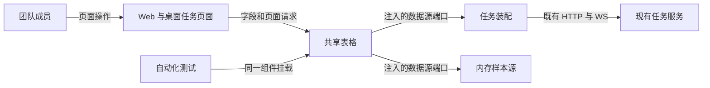
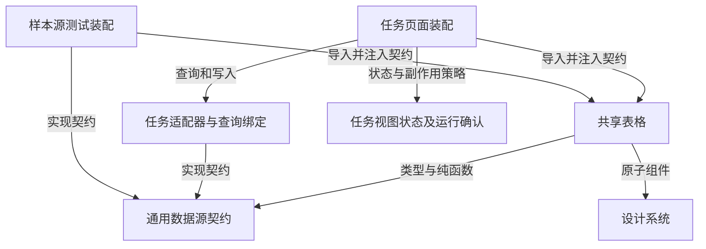
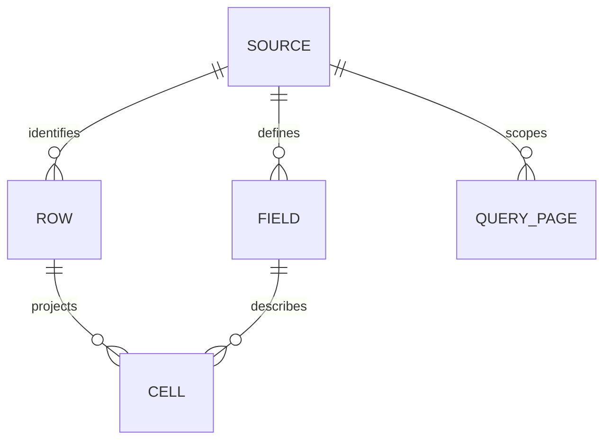
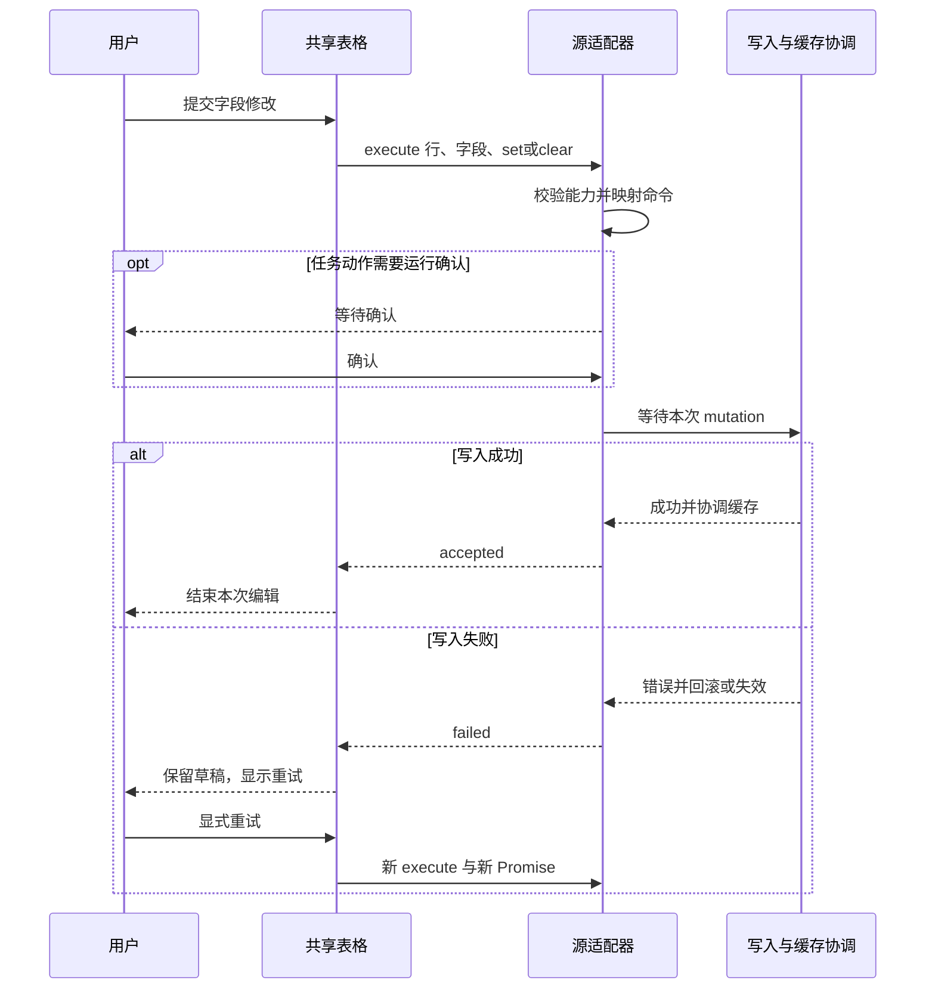

建议将下一 PR 锁定为 **T1b：生产任务表格迁入共享 TableView，并以第四类测试源证明可替换性**。这补齐原 T1 的组件边界；T2 文档、T3 collection/record 仍按原方案另做。

已核实 [PR #3](https://github.com/quboqin/multica/pull/3) 仍为 OPEN，head 为 `53f49f0f9f120fd67e1f025039dd6a14db504ea5`，base 为 `docs/architecture-handbook@2ef09f14c7cfe22349d7144ead5195988c363ffc`。以下契约以该 head 为基线，可供 kiki 开发、momo 编写独立验收。未发现需要先由用户拍板的新技术或权限选择。

**最小合并单位是一条完整读写链路。** `packages/views/data-view/` 导出真实 `TableView<Row, Query>`；现有任务页面通过 Issue 装配层使用它；测试源也直接挂载这一导出。共享部分包含列布局/虚拟化、选择区间、分组及层级展开、分支分页/重试、编辑期间结构冻结与刷新恢复、编辑结果消费。任务装配层提供查询绑定、字段投影、受控视图状态、导航/创建/导出等领域操作及单元格扩展。

当前 `packages/views/issues/components/table-view.tsx:161` 的 props、`:1282` 的装配和 `:1850` 的行构建仍在同一组件；`packages/views/data-view/index.ts:1` 只导出两个函数。迁移后旧路径可以保留任务装配组件，但不能继续拥有另一套表格行循环、分页或分组算法，也不能仅把已有 `DataTable` 包一层就宣称完成。业务单元格可以注入；整张 tbody、分页状态机或 Issue store 不能藏在“slot”里。

| 选择 | 实施与维护成本 | 结论 |
| --- | --- | --- |
| 原地抽出共享引擎，Issue 保留查询缓存及业务装配，测试源使用同一引擎 | 中等重构；沿用现有技术与行为；适合现有团队，组件和缓存可分层验证，无新运维或供应商依赖 | **推荐** |
| 先新建通用表格、测试源，稍后迁移 Issue | 前期较小，但迁移前两套行为并存、回归与同步成本更高 | 可作开发过程，不能作为本 PR 的完成边界 |



这张图限定运行范围：生产只迁移现有任务表格，第四类源只服务测试。没有新增产品路由、数据库表、服务端接口、权限模型或部署拓扑；不增加新框架。它证明组件可替换，尚不证明 task/doc/record 三源已实现。

**分组与字段按以下语义锁定，名称可依仓库惯例微调。** 通用类型放 `packages/core/data-source/`，不依赖 `Issue*`。现有 `DataSource` 在 `packages/core/data-source/types.ts:39`，其泛型需要补足共同语义；不另造一个与它并存的读写引擎。

| 契约 | 本 PR 必须满足 |
| --- | --- |
| 行 | `Row` 不要求任何业务字段；`rowId(row)` 返回源内稳定 ID。行的直属子项数量由适配器投影，不能让引擎读取 `row.issue`、`direct_child_count` 或业务 parent 字段。渲染节点只区分 `row/group/loading/error` 等结构类别。 |
| 查询 | 保留泛型 `Query` 承载源的过滤/范围；共享层将其当不透明值。表格排序、分组选项统一使用字段 ID，由适配器翻译成源查询。搜索/过滤改变必须进入查询身份；不在本 PR 重写通用过滤 AST、facet 服务或保存视图协议。 |
| 字段 | 所有现有系统列和自定义列进入同一字段目录：稳定 `id`、显示名称、值读取函数、值类型/编辑配置、排序/分组能力、逐行设置/清空能力。展示名不是 ID；自定义字段 ID 不因改名改变。值保持类型，不能用格式化文案写回。 |
| 编辑 | 统一 `execute({ row, fieldId, change })`，其中 `change = {op:'set', value} \| {op:'clear'}`；`row` 对引擎不透明。字段映射和校验在适配器执行，再转成领域 command。`0`、`false`、空字符串不能靠 truthy 判断变成 clear；数组空值是否等于 clear 由既有字段规则显式转换。 |
| 分组 | `groupBy = null \| {fieldId}`；数据源提供分页 `readGroups`，组描述包含不透明 `key`、展示 label、`valueState: value/unset/unavailable`、完整匹配数 `count`。源/装配解析名称，共享层不识别 status、project 或 property。组 key 原样用于读行与折叠，不能从 label、下标或值重新拼接。 |
| 分支与分页 | 分支引用为 `{groupKey: string\|null, parentRowId: string\|null}`，page 为 `{limit,cursor}`。普通行页与组页分别分页；返回 `nextCursor`、完整匹配行数 `total`，行页另含当前分支总数 `branchTotal`。组页的 total 不是组数；数量不能从已加载页推算。游标不透明、受源的 `maxPageSize` 限制。 |
| 层级与失败 | Issue 保留现有同组子项嵌套、跨组子项位于组根的行为；测试源可以 `hierarchy=false`。首次分组只需现有 Table 的单层字段分组，不扩展 board 的 compound 分组。错误显示在对应组/分支并显式重试；不下载全量数据在浏览器补算。无法继续使用的分组经适配器错误分类后给出提示并清理相关游标。 |

具体映射必须在 PR 中列出并测试：Issue 的 `title/status/priority/assignee/project/labels/start_date/due_date` 等写入现有 update/run-confirm 链；不可编辑的 identifier、时间戳、进度等只投影。自定义字段读取 `issue.properties[propertyId]`，set/clear 分别走现有 property mutation 的逐请求 `mutateAsync`。排序从字段 ID 映射到现有 wire sort；分组从字段 ID 映射到现有 status/assignee/project/parent/property 语义。只暴露当前服务端支持的能力，不能因为字段是某类型就自动开放排序或分组。



箭头是允许的代码依赖。禁止 `T/C → I/P`，包括 type import、barrel 重导出和间接依赖；禁止 `ui → core`。共享层不读取任务 store 或弹窗注册表。沿用 Issue 的持久化偏好，由装配层以普通受控 props/callbacks 传入；新增 Zustand 状态若确有需要，只能放 core。

**Source identity、查询 identity 和缓存形状分开处理。** 当前 adapter 的 `key:'issues'`（`packages/core/issues/table-data-source.ts:71`）不是完整身份；当前表格结构身份也只含分组/层级（`packages/views/issues/components/table-view.tsx:1452`）。本 PR 必须补全如下隔离：

- 数据源身份使用结构化 `(workspaceId, namespace, sourceId)`；Issue 是工作区内的任务源，测试源以样本库 ID 区分。身份不使用显示名、对象引用、回调引用、随机值或每次数据刷新的 revision。
- 通用默认查询键形如 `['data-source', workspaceId, namespace, sourceId, 'rows', normalizedQuery, groupBy, branch, hierarchy, limit, cursor]`。组目录使用独立 `'groups'` 键；infinite query 的游标进入 `pageParam`。规范化后的 query 包含范围、过滤、搜索、排序；分支 key、query fingerprint、cursor 均不单独充当全局身份。排序数组顺序不能被规范化打乱。
- 保存视图 ID 属于视图状态身份：列宽、列序、折叠等按 `sourceIdentity + viewId` 隔离；仅当 viewId 影响服务端结果/权限时才进入读取身份。同源同查询可共用服务器缓存；两个不同源即使所有字段、行 ID、过滤和视图名相同，也不能串缓存或偏好。
- 源/工作区切换时清掉当前编辑、选择锚点、冻结快照和分支游标，恢复目标视图自身偏好；`keepPreviousData` 不能将 A 源的数据短暂显示给 B 源。仅 query 改变时保留存量允许的过渡行为，同时重置失效游标。旧请求/写入必须捕获原 source identity，只能更新原源缓存；旧完成回调不能关闭新源编辑器。Signal 的支持范围要明示，不把未透传的 Signal 当作隔离保证。

源绑定还须保证请求使用原工作区上下文：若现有 API 客户端无法显式绑定 wsId，切换工作区后应取消尚未提交的确认操作，不能在新工作区上下文发出旧命令。已经发出的请求仍按各自最终结果结束；这与清理新表 UI 是两个独立步骤。按源隔离的缓存键本身不能保证请求头正确。

**Issue 的物理缓存推荐继续使用原 key 与原 DTO，通过查询绑定的 `select` 投影成通用页面。** `packages/core/issues/queries.ts:286`、`:319` 仍可作为领域查询入口；共享层仅消费注入的通用 query binding（行页 options、组页 options、分支重试/刷新身份）。`queryFn` 内调用源读取，不能在组件 effect 另开查询或维护第二份服务器数据。绑定的缓存类型使用泛型保持类型安全，不能在共享层强转为 Issue。

这里不仅要保留 `issueKeys` 前缀：`packages/core/issues/cache-coordinator.ts:163` 扫描表缓存，`:510` 直接处理 `row.issue`。因此不能在旧 key 下换成通用 RowPage。`select` 转换观察者看到的数据而不改变实际缓存内容，适合这个边界。[TanStack select 文档](https://tanstack.com/query/latest/docs/framework/react/reference/functions/useQuery)

另一可行方案是一次性把 Issue 也迁到新缓存命名与形状，并同步修改所有 mutation、WS、回滚和窗口失效逻辑；这会明显扩大测试面，不推荐进入本最小切片。保留旧键的 Issue binding 必须限定为 Issue 源，禁止借该 binding 接入任意 sourceId；第四类源使用上述通用键。Issue 现有页面大小保持固定约束；任何允许变化的 limit 都必须进入键，不能同键不同请求。



这是前端逻辑模型，不是数据库变更：SOURCE 以工作区/命名空间/源 ID 标识，ROW 和 FIELD 的 ID 只在源内唯一，CELL 是读取函数得到的投影；QUERY_PAGE 由源、查询、分支及分页参数定位。服务器行仍只存在于 React Query，编辑草稿只属于客户端；本 PR 无 DDL、数据搬迁或新服务端模型。

**只读门禁覆盖这张表产生的所有行写入，自定义字段不再豁免。** 可执行条件是“源可写 ∧ 当前行允许该操作 ∧ 字段允许 set/clear ∧ 执行器存在”；UI 和 execute 入口都检查，提交时重读当前能力，不能只在首次 render 检查。无 actions provider 的 Issue 装配必须让系统字段、自定义字段、清空及表内创建/子任务动作全部不可写。若表内保留批量/上下文写操作，也受同一限制。选择、复制、导航、搜索、列宽/列序/显隐等读操作和显示偏好可以使用；前端门禁不替代既有服务端鉴权。

`packages/views/issues/components/pickers/custom-property-picker.tsx:92` 的 `CustomPropertyValueEditor` 直接发 mutation，本表不得再调用它。`:127` 已有无 mutation 的 `CustomPropertyValueInput`，可先在 Issue 字段装配中复用并接到统一 commit；共享 TableView 不得反向 import 这个 Issue 路径。九类存量字段在本表的显示、设置、清空都要继续可用，但本 PR 不必把九类 editor 全部迁成通用库：默认共享 editor 至少支持测试源的 text/number/select/checkbox，其余通过受控字段扩展保留，扩展只拿值、只读状态、commit/result，不自行调用 API。

需特别区分“源只读”和“字段只能清空”。现有 `isCustomPropertyReadOnly` 在字段归档、未知类型、未知单 actor 时仍允许 Clear（同文件 `:53`、`:180`）。新契约使用独立的 `canSet/canClear`：源只读时两者均 false；有写权时按既有规则保留明确的清空入口，不把它重新解释成全局只读。未知值不能先显示成空再覆盖，multi_actor 的未知项保留语义不变。

列头的“添加列”当前是选择已有列（`packages/views/issues/components/table-view.tsx:492`）；本 PR 保留该范围，**不新增建字段、改类型/选项、字段归档、schema 权限或 relation**，不扩展到详情页/其他视图的直写路径。这避免把本次表格门禁混同于整个 FR-001/T5 字段系统交付。

**沿用 T1 的最终结果契约，并让共享 editor 真正消费它。** `accepted` 只在对应写入完成后出现；`cancelled` 只代表提交前取消；`failed` 是终态，重试创建新操作/Promise。待确认或写入中不能提前清草稿、报告成功；失败保留可恢复草稿并展示错误，取消恢复已确认值。缓存 patch/回滚/分组计数失效由源绑定负责，table 不用本地行重算服务器窗口；返回 accepted 未携带 row 时仍需通过原缓存协调/读取显示权威值。



该图覆盖主流程与失败重试。确认前关闭另走 cancelled，零写入；已提交的旧弹窗被替换后仍由原 mutation 决定结果，不能误报取消或关闭新实例。复用 PR #3 的实例/阶段保护，不在共享层重新实现 run-confirm。

**第四类测试源采用独立内存样本库，避免引入生产模型。** 例如 `SampleRow = { key, caption, amount, bucket, attributes }`，不包含 Issue 包装、status、assignee、properties 或任务运行能力；字段映射包含 `caption` 文本、`amount` 数值、`bucket` 单选/空组，以及 `attributes.flag` checkbox。同一套测试创建 `sample-a/sample-b` 两个源，复用相同 rowId、fieldId、query；另加两个工作区。配置小 page size（如 2），至少跨两页，组目录本身也跨页。测试替身维护权威数据，可控延迟、拒绝一次后成功，并记录读写日志；真正挂载共享 TableView、真实 QueryClient 和 editor，不 mock TableView、分页/分组模型或写入结果桥接。

这里的“刷新”至少验证写入后 invalidate/refetch，以及卸载后以新的 QueryClient 挂载、从同一测试库重读。不是只断言 setQueryData 后文案变化；内存源不承诺浏览器重载持久化，也不充当 collection 的真实读写验收。

| 门禁 | 可复验通过标准 | 主验证层 |
| --- | --- | --- |
| G1 依赖与生产接线 | Issue 实际页面与样本源均挂同一 TableView；共享路径及其 import 闭包无 Issue DTO、查询/store/gate；无 `as Issue`、复制表格或另一套行模型 | core 类型/导入边界检查 + views 组件装配 |
| G2 真正读写 | 样本源分页、选行、排序、组展开；设置、清空、刷新重读值正确；不要求 Issue provider，任务 API/运行确认零调用 | views 真实组件 + QueryClient |
| G3 分组/游标 | 组页与行页各自翻页；重复 label 的组不合并；unset/unavailable 区分；头页更新淘汰旧尾游标；延迟尾页不复活旧行；失败仅显式重试，不回退客户端分组 | core 边界矩阵 + views 一条连贯链路 |
| G4 双重隔离 | 同 ws 两源、同源名两 ws、相同行/字段/query 均不串缓存；切换时无旧 placeholder/草稿/选择残留；旧读写晚到只影响原源；列偏好按源与视图隔离 | core key/identity + views 切换回归 |
| G5 全表只读 | 实际 Issue 表缺 provider，以及样本源只读；鼠标、键盘、已打开 editor 后撤销能力、程序化 execute 都零写入；系统字段和自定义字段 set/clear 均覆盖，clear-only 字段单列验证 | views + adapter 契约 |
| G6 最终结果 | 待确认零写入/未完成、取消、确认后单写、失败保留草稿、新会话重试；并发反序/卸载均结束；提交后同类型弹窗替换不互关；自定义字段 Promise 也覆盖连续操作/失败 | 复用 T1 真 QueryClient/ModalRegistry 测试，补共享 editor 消费 |
| G7 存量回归 | 原系统列与九类属性值保持；property mutation/WS 更新、旧缓存形状、窗口失效、未挂载后重挂刷新正确；过滤排序、私有视图/偏好、列宽拖动、导出、导航及层级虚拟化不退化 | core/views 现有用例 + Issue Table E2E |

核心组合建议由 kiki 自验后，momo 对**同一完整 head SHA**独立复验。失败用例保留首败日志与隔离复跑结果，不把此前别的 head 的通过数搬过来。纯矩阵放 core 无 DOM 测试；组件层只保留连贯链路和具体回归，避免重复铺满同一矩阵。日志证据记录 source/query/branch/operation identity 与结果，不记录字段正文或凭据；沿用现有错误提示/诊断，不新增产品埋点。

以下是实施后的复验命令草案，本轮未执行。新增测试文件按对应目录放置，原测试可随抽取迁移到所属模块，但不能删除行为覆盖来使检查通过：

```bash
pnpm --filter @multica/core test data-source issues/table-data-source.test.ts issues/cache-coordinator.test.ts issues/ws-updaters.test.ts properties/mutations.test.tsx modals/store.test.ts issue-views/baseline.test.ts issues/stores realtime/use-realtime-sync.test.ts
pnpm --filter @multica/views test data-view issues/components/table- issues/components/data-table- issues/actions/table-command-executor.test.ts issues/actions/run-confirm-gate.test.ts issues/surface/use-issue-surface-actions.test.tsx modals/run-confirm.test.tsx
pnpm typecheck
pnpm --filter @multica/core lint
pnpm --filter @multica/views lint
pnpm build
git diff --check 53f49f0f9f120fd67e1f025039dd6a14db504ea5 HEAD
```

环境与交付沿用现有工具：本地使用合成数据与隔离库，`make up C=api,web` → `make status` 核对实际 URL/commit，再运行 `make env-exec ARGS="-- pnpm exec playwright test e2e/issue-table.spec.ts"`。该文件现有四条链路覆盖 1,001 行分页分组、层级、实时排序边界和分支重试（`e2e/issue-table.spec.ts:86`、`:175`、`:269`、`:372`）。补一条真实 API 的系统字段/自定义字段设置清空与重读链路；Desktop 做同构建的编辑、导航和列偏好 smoke，记录结果。测试数据通过既有 TestApiClient 建立清理，不调用真实已登录智能体。

CI 跑上述窄门禁及仓库原有检查；耗时预算先按静态 5 分钟、契约 10 分钟、E2E 15 分钟观测，超时给原因，不以无限重试换通过。Stage 使用同一候选构建和既有服务拓扑，仅容量/合成数据/沙箱凭据有差异；生产发布留在原验收流程。本 PR 不需要新增迁移或运行 `make test` 来证明未改动的 Go；若实际 diff 出现服务端变更，应先重新评估范围。PR 交接报告本地结果及 CI 当前状态即可，不等待后台 CI 作为本轮交付条件。

**分支采用堆叠，PR #3 继续冻结。** 推荐新分支 `feature/cortex-g1-tableview` 从完整 `53f49f0...` 创建，新 PR 初始 base 为 `feature/cortex-g1`，标题可用 `MAGI-11: extract shared TableView and verify an independent source`。描述写明依赖 PR #3、本次比较区间及上述门禁；不要写 `Closes/Fixes MAGI-11`，因为 G-1 尚未完成。等待 PR #3 合入后再从目标分支开发也可行，维护最简单，但会阻塞下一切片准备，故推荐堆叠。

1. PR #3 尚未合入时，评审比较 `53f49f0...HEAD`；新 PR 可评审/测试，但不能合入其 base `feature/cortex-g1`，否则会改动 PR #3 的 head。保持父分支冻结，先后顺序由描述明确。
2. PR #3 合入后，重新核实它的**实际目标分支及 merge 方式**。若仍是 `docs/architecture-handbook` 且原 T1 提交保留为祖先，新 PR 改 base 到该分支并检查 diff；不要自行换成 main。
3. 若 squash/rebase merge 使 T1 原 SHA 不再是祖先，从旧 head 留备份，执行思路为 `git rebase --onto <实际目标分支最新提交> 53f49f0f9f120fd67e1f025039dd6a14db504ea5 feature/cortex-g1-tableview`，只重放 T1b 提交。核对 range-diff 与新 PR diff，再以新 head 重跑门禁；协调后如需更新已推分支，用限定该分支的 force-with-lease。`--onto` 支持只移植指定基点之后的提交。[Git rebase 文档](https://git-scm.com/docs/git-rebase#_transplanting_a_topic_branch_with_onto)
4. 不因为 GitHub 自动改 base 或删父分支就省略核对；T1b 不能重复携带 T1 或文档基线提交。新 base/new head 都须写入验收证据。

开发可按“共享读链路 + 样本源 → 系统/自定义字段写入与只读 → 存量/E2E 证据”组织可审阅提交，但**三段通过后才构成这个 PR 的可合并纵切**，不再把仅 types/helper 作为交付。初估 M，主要风险是现有表格体量和编辑生命周期；若超过 3 天应继续拆可验收的纵切并说明边界，不能降低本表只读或生产接线门禁。测试样本准备可与抽取并行。

回退以 T1b 的前端变更为单位恢复到已通过 T1 的行为；既有 API、缓存格式和持久化偏好不做破坏性变更，因此无数据回滚脚本。撤销时保留 PR #3 的 Promise/弹窗修复，不回退整个 G-1 历史。生产是否发布仍由原用户验收决定。

本轮完成固定提交的只读源码核对、历史方案及最新 QA 附件核对；独立执行 T1 base→head 的 `git diff --check` 通过，未运行自动化或浏览器测试。未修改业务代码、实施分支或 PR，未创建 issue 等平台资源或改变 issue 状态。MAGI-11 当前 `in_progress` 与整体进度一致；本次交付是开发前契约，不是 T1b 已实现或 G-1 完成的声明。
